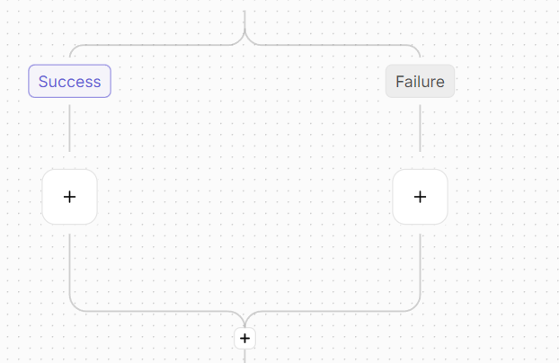

# Native Error Handling — `onSuccess` / `onFailure` Paths Under a Step

## The Problem

When a step in a flow fails, users have no clean way to react to it. **Continue on Failure** (CoF) lets the flow keep going, but the failure is invisible to anything downstream. Today the workaround is to add a router after the failing step and configure conditions on it — clunky, manual, and a janitorial chore the user owns.

This blocks a common pattern:

- "If the API call fails, post the error to Slack."
- "If the response is a 401, refresh the token; otherwise continue."
- "Log the failure reason, then move on."

## What We're Shipping

Three changes, woven together:

1. **A failed step now exposes its error to the rest of the flow.** Reference it as `{{step_name.error.message}}` — same syntax as any other step output.
2. **Steps with Continue on Failure on sprout two native paths: `Success` and `Failure`.** Both labelled, both with `+` buttons to add steps inside, both reconverging into the existing chain. No router to add or delete.
3. **The data picker shows an "On failure" section** under any step that has CoF on — pick `error.message` the same way you'd pick any output field.

## How a User Will Use It

1. Add an HTTP step. Toggle **Continue on Failure** on.
2. The step now forks into two paths on the canvas: `Success` and `Failure`. Each has a `+` button.
3. Drop a Slack alert into the `Failure` path; drop a transformation into the `Success` path; drop the rest of your flow after the convergence.
4. From any step downstream, pick `{{http_step.error.message}}` from the data picker.
5. Run: when the HTTP step fails, Slack fires → flow continues. When it succeeds, the transformation fires → flow continues.



No piece, no scripting, no router janitorial work.

## Why Not a Manual or Synthetic Router

We considered two simpler-looking routes and rejected both. The rejected approaches are documented here so the design rationale is on the record.

**Manual router** — give the user a button to insert a regular router after the failing step; user owns it. Cheap to ship, but toggling CoF off leaves an orphan router for them to clean up. Error handling is meant to be a **first-class concept in flows** — its wiring shouldn't be a manual janitorial task.

**Synthetic router** — auto-insert a router with a `meta: 'errorHandler'` marker, then re-skin it on the canvas to look like native paths. Solves the cleanup problem but at high cost:

- Requires special-casing the load-bearing canvas tree-walker (suppress the router card, hoist its branches under the parent step).
- Requires atomic copy / move / duplicate / delete to keep the router glued to its parent step.
- Requires two-way invariant maintenance between `meta.forStep` on the router and a back-reference on the parent step.
- Requires hiding the synthetic node from step search, suppressing its sample data, gating its settings panel.
- Verdict: clever code in load-bearing places. Every future contributor would trip over the special case.

**First-class fields** win: tree-walkers and operations treat the new branches like any other child slot (`nextAction`, router branches, loop bodies). Uniform diffs across the codebase, no special cases, no glue.

## Where the Changes Live

### 1. Schema — wrap the new branches with the toggle that gates them

**File:** `packages/shared/src/lib/automation/flows/actions/action.ts` &nbsp;·&nbsp; ~8 lines added

```diff
+ const ContinueOnFailureBranches = z.object({
+     onSuccess: z.lazy(() => FlowAction).optional(),
+     onFailure: z.lazy(() => FlowAction).optional(),
+ })

  const ErrorHandlingOptions = z.object({
      continueOnFailure: z.object({ value: z.boolean() }).optional(),
+     continueOnFailureBranches: ContinueOnFailureBranches.optional(),
      retryOnFailure: z.object({ value: z.boolean() }).optional(),
  })
```

`nextAction` stays where it is at the top level of the action — **reused** as the convergence point. Bump `packages/shared` patch.

### 2. Engine — fork-and-converge based on outcome

**File:** `packages/server/engine/src/lib/handler/flow-executor.ts` &nbsp;·&nbsp; ~25 lines added

After a step finishes, the executor decides what to walk next:

| CoF | Result | What runs |
|---|---|---|
| off | success | `nextAction` |
| off | failure | halt |
| on | success | `onSuccess` → `nextAction` |
| on | failure | `onFailure` → `nextAction` |

Empty/missing branches skip straight to `nextAction`. Failure inside `onFailure` halts the run unless that inner step also has CoF on (recursive recovery is opt-in).

This mirrors how Routers fork-and-converge today — the engine is specialising the pattern, not inventing a new one.

### 3. Engine — expose the failed step's error to downstream steps

**File:** `packages/server/engine/src/lib/handler/context/flow-execution-context.ts` &nbsp;·&nbsp; +5 / -1 lines

```diff
  function extractOutput(steps) {
      return Object.entries(steps).reduce((acc, [stepName, step]) => {
-         acc[stepName] = step.output
+         if (step.status === StepOutputStatus.FAILED) {
+             acc[stepName] = { error: { message: step.errorMessage } }
+         } else {
+             acc[stepName] = step.output
+         }
          return acc
      }, {})
  }
```

Successful steps behave exactly as before; failed steps now have a defined shape downstream code can read.

### 4. Tree-walker — single edit site, every helper inherits

**File:** `packages/shared/src/lib/automation/flows/util/flow-structure-util.ts` &nbsp;·&nbsp; +9 lines, **one** function

`transferStep` is the only function in this file that explicitly recurses into a step's child slots (`firstLoopAction`, router `children`, `nextAction`). Every other walker — `getAllSteps`, `getStep`, `findPathToStep`, `getAllChildSteps`, `isChildOf`, `transferFlow`, `findUnusedName(s)`, `extractConnectionIds`, `extractAgentIds` — delegates to `transferStep` directly or transitively. **Edit `transferStep` and they all inherit the new slots automatically.**

```diff
  function transferStep<T extends Step>(step, transferFunction): Step {
      const updatedStep = transferFunction(step as T)
      switch (updatedStep.type) {
          case FlowActionType.LOOP_ON_ITEMS: { /* recurse into firstLoopAction */ break }
          case FlowActionType.ROUTER:        { /* recurse into children[]    */ break }
          default: break
      }

+     const branches = updatedStep.settings?.errorHandlingOptions?.continueOnFailureBranches
+     if (branches?.onSuccess) {
+         branches.onSuccess = transferStep(branches.onSuccess, transferFunction) as FlowAction
+     }
+     if (branches?.onFailure) {
+         branches.onFailure = transferStep(branches.onFailure, transferFunction) as FlowAction
+     }

      if (updatedStep.nextAction) {
          updatedStep.nextAction = transferStep(updatedStep.nextAction, transferFunction) as FlowAction
      }
      return updatedStep
  }
```

**What inherits the change for free:**

| Helper | Used by | Inherits because |
|---|---|---|
| `getAllSteps` | step search, validators, name-generation, connection extraction | calls `transferStep` to flatten the tree |
| `getStep`, `getStepOrThrow` | every op | uses `getAllSteps` |
| `findPathToStep` | run state, run-info widget | uses `getAllSteps` |
| `getAllChildSteps` | `isChildOf`, skip-checks | uses `getAllSteps` (with `nextAction: undefined`) — branches still visited because they live in `settings`, not on `nextAction` |
| `isChildOf` | flow-canvas-utils `isSkipped` | uses `getAllChildSteps` |
| `transferFlow` | every operation that mutates the tree | clones via JSON then calls `transferStep` |
| `extractConnectionIds`, `extractAgentIds` | dependency tracking | uses `getAllSteps` |

Operations like `ADD_ACTION`, `DELETE_ACTION`, `MOVE_ACTION`, importer, exporter, validator all delegate to these helpers — none need their own diff.

### 5. Operations — two new step locations

**Files:** `step-location.ts` (~2 lines), `add-action.ts` (~10 lines)

```diff
  enum StepLocationRelativeToParent {
      AFTER = 'AFTER',
      INSIDE_LOOP = 'INSIDE_LOOP',
      INSIDE_BRANCH = 'INSIDE_BRANCH',
+     INSIDE_ON_SUCCESS_BRANCH = 'INSIDE_ON_SUCCESS_BRANCH',
+     INSIDE_ON_FAILURE_BRANCH = 'INSIDE_ON_FAILURE_BRANCH',
  }
```

`ADD_ACTION` gains a small dispatch arm in `add-action.ts` to insert at the head of the corresponding branch (or chain into the branch's existing `nextAction`).

`MOVE_ACTION` decomposes into DELETE + ADD via `_getImportOperations`, so it inherits the fixes in 5c and 5d below — no direct diff.

### 5c. `DELETE_ACTION` — re-stitch when a branch head is deleted

**File:** `packages/shared/src/lib/automation/flows/operations/delete-action.ts` &nbsp;·&nbsp; ~10 lines added

The `DELETE_ACTION` callback is **not** a pure `transferStep` delegate — it tests `parentStep.nextAction.name === name`, `parentStep.firstLoopAction.name === name`, and `parentStep.children[i].name === name`, then re-stitches the chain. Mirror this for the new branch slots: when a step is the head of `branches.onSuccess` / `branches.onFailure`, replace the slot with that step's `nextAction` (or undefined).

```diff
  switch (parentStep.type) {
      case FlowActionType.LOOP_ON_ITEMS: { /* ... */ break }
      case FlowActionType.ROUTER:        { /* ... */ break }
      default: break
  }
+ const branches = parentStep.settings?.errorHandlingOptions?.continueOnFailureBranches
+ if (branches?.onSuccess?.name === name) {
+     branches.onSuccess = branches.onSuccess.nextAction
+ }
+ if (branches?.onFailure?.name === name) {
+     branches.onFailure = branches.onFailure.nextAction
+ }
```

Without this, deleting the head of either new branch leaves a dangling reference inside `errorHandlingOptions`.

### 5d. Import / round-trip — emit ADD ops + strip on clone

**File:** `packages/shared/src/lib/automation/flows/operations/import-flow.ts` &nbsp;·&nbsp; ~25 lines added

Two functions in this file walk the tree directly and need explicit branch handling:

1. **`_getImportOperationsForSteps`** — emits `ADD_ACTION` ops for every step in an imported flow. It explicitly switches on `LOOP_ON_ITEMS` (emits `INSIDE_LOOP`) and `ROUTER` (emits `INSIDE_BRANCH` per child). Add an unconditional pass over `errorHandlingOptions.continueOnFailureBranches`: if `onSuccess` / `onFailure` is present, emit `ADD_ACTION` with the corresponding new `INSIDE_ON_*_BRANCH` location, then recurse into that branch's chain.

2. **`removeAnySubsequentAction`** — clones an action and strips any sub-tree that the recursive importer will re-emit as separate ADD ops. Currently strips `firstLoopAction`, recurses into `children`, and deletes `nextAction`. Add: delete `errorHandlingOptions.continueOnFailureBranches.onSuccess` / `.onFailure` from the cloned action before returning, so they get re-emitted via the new `INSIDE_ON_*_BRANCH` ADD ops rather than carried inline.

Without these, an imported flow silently loses everything inside the new branches — and `MOVE_ACTION` (which calls `_getImportOperations` on the source step) inherits the same data loss.

### 6. Canvas — render the fork when CoF is on

**File:** `packages/web/src/app/builder/flow-canvas/utils/flow-canvas-utils.ts` &nbsp;·&nbsp; ~75 lines added across four touchpoints

`buildFlowGraph` is a recursive layout builder: for each step it produces a step node, optionally a **child subgraph** (loops and routers have their own), and recurses into `step.nextAction`. Each subgraph reports a bounding box; the next step is offset by that box's height. The cascade is fully automatic — once a step's subgraph grows, every ancestor's `nextAction` placement adjusts down the tree without per-node bookkeeping.

The work splits into four small touchpoints. The crucial insight: **`buildRouterChildGraph` is already a polished fork-and-converge implementation** — we borrow its primitives wholesale.

**a) `buildFlowGraph` — add a third dispatch arm** &nbsp;·&nbsp; +3 lines

```diff
+ const hasCofBranches = step.settings?.errorHandlingOptions?.continueOnFailure?.value === true;
  const childGraph =
      step.type === FlowActionType.LOOP_ON_ITEMS ? buildLoopChildGraph(step)
    : step.type === FlowActionType.ROUTER       ? buildRouterChildGraph(step)
+   : hasCofBranches                            ? buildContinueOnFailureBranchesGraph(step)
                                                : null;
```

**b) `createStepGraph` — extend the straight-line skip list** &nbsp;·&nbsp; +3 lines

Today the step→nextAction straight-line edge is skipped for `LOOP_ON_ITEMS` and `ROUTER` because those subgraphs handle the connection internally (loop-return node / router-end edges feed into `nextAction`). A CoF-active step is the same case — its fork-and-converge subgraph terminates in a `subgraphEnd` node.

```diff
  edges:
      step.type !== FlowActionType.LOOP_ON_ITEMS &&
-     step.type !== FlowActionType.ROUTER
+     step.type !== FlowActionType.ROUTER &&
+     !hasCofBranches
          ? [straightLineEdge]
          : [],
```

**c) New helper — `buildContinueOnFailureBranchesGraph(step)`** &nbsp;·&nbsp; ~60 lines, near-clone of `buildRouterChildGraph`

```ts
const buildContinueOnFailureBranchesGraph = (step: FlowAction): ApGraph => {
    const branches = step.settings?.errorHandlingOptions?.continueOnFailureBranches;
    const branchOrder = [
        { branch: branches?.onSuccess, label: t('Success'), location: StepLocationRelativeToParent.INSIDE_ON_SUCCESS_BRANCH },
        { branch: branches?.onFailure, label: t('Failure'), location: StepLocationRelativeToParent.INSIDE_ON_FAILURE_BRANCH },
    ];

    const childGraphs = branchOrder.map(({ branch, location }, index) =>
        branch
            ? buildFlowGraph(branch)
            : createBigAddButtonGraph(step, {
                parentStepName: step.name,
                stepLocationRelativeToParent: location,
                branchIndex: index,
                edgeId: `${step.name}-cof-branch-${index}-start-edge`,
              }),
    );

    const childGraphsAfterOffset = offsetRouterChildSteps(childGraphs);   // reused as-is
    const maxHeight = Math.max(...childGraphsAfterOffset.map((cg) => calculateGraphBoundingBox(cg).height));

    const subgraphEnd: ApGraphEndNode = { /* same shape as router subgraph end */ };

    const edges = childGraphsAfterOffset.flatMap((childGraph, branchIndex) => [
        // fork: ROUTER_START_EDGE with static label + CoF location
        { id: ..., source: step.name, target: childGraph.nodes[0].id, type: ApEdgeType.ROUTER_START_EDGE,
          data: { label: branchOrder[branchIndex].label,
                  stepLocationRelativeToParent: branchOrder[branchIndex].location,
                  branchIndex, isBranchEmpty: isNil(branchOrder[branchIndex].branch),
                  drawHorizontalLine: true, drawStartingVerticalLine: branchIndex === 0 } },
        // converge: ROUTER_END_EDGE into shared subgraph end
        { id: ..., source: childGraph.nodes.at(-1)!.id, target: subgraphEnd.id, type: ApEdgeType.ROUTER_END_EDGE,
          data: { drawEndingVerticalLine: branchIndex === 0,
                  verticalSpaceBetweenLastNodeInBranchAndEndLine: ...,
                  drawHorizontalLine: true,
                  routerOrBranchStepName: step.name,
                  isNextStepEmpty: isNil(step.nextAction) } },
    ]);

    return {
        nodes: [...childGraphsAfterOffset.flatMap((cg) => cg.nodes), subgraphEnd],
        edges: [...childGraphsAfterOffset.flatMap((cg) => cg.edges), ...edges],
    };
};
```

Reuses `offsetRouterChildSteps`, `createBigAddButtonGraph`, `calculateGraphBoundingBox`, `ROUTER_START_EDGE`, `ROUTER_END_EDGE`, `GRAPH_END_WIDGET`. **No new edge type, no new node type, no edits to edge components.** Static labels (`Success` / `Failure`) ride on the existing `label` field of `ROUTER_START_EDGE`.

**d) `createAddOperationFromAddButtonData` — pass through the new locations** &nbsp;·&nbsp; ~5 lines

The `+` button on each empty branch already stamps its `stepLocationRelativeToParent` on the `ApButtonData`. Extend the existing `INSIDE_BRANCH` arm so the new locations also serialise their `branchIndex` into the `ADD_ACTION` request.

#### How this affects subgraph calculation

A CoF-active step's subgraph height becomes:

```
VERTICAL_OFFSET_BETWEEN_ROUTER_AND_CHILD
  + max(onSuccess subtree height, onFailure subtree height)
  + ARC_LENGTH
  + VERTICAL_SPACE_BETWEEN_STEPS
```

— the same formula `buildRouterChildGraph` already uses. Width becomes the sum of the two branches' widths plus one `HORIZONTAL_SPACE_BETWEEN_NODES`. Both numbers feed into `calculateGraphBoundingBox`, which feeds back into `buildFlowGraph`'s `offsetGraph(nextStepGraph, { y: boundingBox.height })` for the next step. **No edits to ancestor positioning logic** — the cascade is the same one routers and loops already trigger. Every parent `buildFlowGraph` invocation up the tree sees a taller child bounding box and pushes its own `nextAction` chain down accordingly.

#### When CoF is off

`hasCofBranches` is false → no child subgraph → straight-line edge to `nextAction` is restored. Branch data inside `continueOnFailureBranches` is still attached to the action object (and still walked by `transferStep` for ops like serialise/import) but is invisible to layout. Toggle back on → the dispatch arm fires, the fork reappears with content intact.

### 6e. Server-side canvas position math — shared `flow-canvas-util.ts`

**File:** `packages/shared/src/lib/automation/flows/util/flow-canvas-util.ts` &nbsp;·&nbsp; ~20 lines added

Distinct from the web canvas in §6: this is the **shared** layout module that the **MCP `ap_flow_structure` tool** calls via `flowCanvasUtils.computeStepPositions(trigger)` to give agents `(x, y)` coordinates for every step. `getFlowBBox` and `buildPositions` both walk `firstLoopAction`, `children`, and `nextAction` directly — no `transferStep` delegation. Without an `onSuccess` / `onFailure` arm, MCP-reported positions for steps inside the new branches will be missing or wrong.

Mirror the existing `ROUTER` arm: when a step has CoF on, treat the two branches as a 2-child router for layout purposes. Vertical offset = `FLOW_CANVAS_ROUTER_VOFFSET`; branch widths sum with `FLOW_CANVAS_HSPACE` between them; subgraph height = `FLOW_CANVAS_STEP_HEIGHT + FLOW_CANVAS_ROUTER_VOFFSET + max(branchHeights) + FLOW_CANVAS_ARC + FLOW_CANVAS_VSPACE`. Add the same arm in both `getFlowBBox` and `buildPositions` so width math and `(x, y)` placement stay consistent with the web canvas (§6).

### 7. Toggle — pure boolean flip, no destructive ops

**File:** `packages/web/src/app/builder/piece-properties/action-error-handling.tsx` &nbsp;·&nbsp; **0 lines**

The existing `onCheckedChange` already just calls `field.onChange(checked)` — flipping `errorHandlingOptions.continueOnFailure.value`. We're explicitly **not** adding the structural side-effects an earlier draft considered (router insertion, confirm dialog). Engine + canvas both read the flag to decide what to execute / render. The diff for this file is empty; this section exists to lock in "do not add side effects" as a design rule.

### 8. Data picker — "On failure" section

**File:** `packages/web/src/app/builder/data-selector/utils.ts` &nbsp;·&nbsp; ~17 lines added

Whenever a step has CoF on, attach an extra branch to its pickable tree right after building its outputs:

```diff
  function traverseStep(step, sampleData, ...) {
      const stepNode = traverseOutput(displayName, [step.name], sampleData[step.name], ...);
+     if (step.settings.errorHandlingOptions?.continueOnFailure?.value === true) {
+         stepNode.children.push({
+             key: `${step.name}_on_failure`,
+             data: { type: 'chunk', displayName: 'On failure' },
+             children: [{
+                 key: `${step.name}_error_message`,
+                 data: {
+                     type: 'value',
+                     displayName: 'Error message',
+                     propertyPath: `${step.name}.error.message`,
+                     value: 'runtime error (Unauthorized 401)',
+                     insertable: true,
+                     tooltip: 'Available at runtime when this step fails.',
+                 },
+             }],
+         });
+     }
      return stepNode;
  }
```

The engine and the picker agree on the same shape (`step.error.message`) — what users pick in the editor is what the runtime delivers.

```
▼ http_step
     Outputs
     ├── status
     ├── body
     └── headers

     On failure
     └── Error message
```

### 9. EE project-state sync — re-clean the branches

**File:** `packages/server/api/src/app/ee/projects/project-release/project-state/clean-flow-state.ts` &nbsp;·&nbsp; ~6 lines added

`cleanAction` hand-rebuilds each action by listing the props it wants to keep and recursing on `nextAction`, `firstLoopAction`, and `children`. The new branches live under `settings.errorHandlingOptions.continueOnFailureBranches`, which gets carried along inside the spread `settings` object — so the data round-trips. **But** the cloned branches still point at their **original** sub-trees, never re-cleaned, so steps inside them keep fields the cleaner is supposed to drop (e.g. `valid`, `lastUpdatedDate` on inner actions).

Add a second pass that re-cleans the branches in-place: clone `settings`, then `branches.onSuccess = isNil(branches.onSuccess) ? undefined : cleanAction(branches.onSuccess)` (same for `onFailure`). EE-only — failing to update this causes silent data drift on Project Release sync (Cloud + EE), not on CE.

### 10. MCP `ap_flow_structure` — parent detection + insert locations

**File:** `packages/server/api/src/app/mcp/tools/ap-flow-structure.ts` &nbsp;·&nbsp; ~10 lines added

Two issues in this MCP tool:

1. **`buildFlowStructure`** does its own parent-relationship detection (looping over `allSteps` and testing `parent.nextAction?.name`, `parent.firstLoopAction?.name`, `parent.children[]?.name`). Won't detect a step whose parent is its `branches.onSuccess` / `branches.onFailure` slot, so its `parentName` and `relationship` come back wrong. Extend `StepInfo['relationship']` with `'on_success_branch'` / `'on_failure_branch'` and add an arm that tests `parent.settings?.errorHandlingOptions?.continueOnFailureBranches?.onSuccess?.name === step.name` (and `onFailure`).

2. **`formatFlowStructure`** lists valid insert locations for `ap_add_step` (it already lists `INSIDE_LOOP` and `INSIDE_BRANCH` per step type). For any action with CoF on, also list `INSIDE_ON_SUCCESS_BRANCH` and `INSIDE_ON_FAILURE_BRANCH`. Without this, agents won't know they can target the new branches.

### Total LoC across the feature

| # | Touchpoint | Added | Removed |
|---|---|---:|---:|
| 1 | Schema (`action.ts`) | ~8 | 0 |
| 2 | Engine (`flow-executor.ts`) | ~25 | 0 |
| 3 | Engine (`flow-execution-context.ts`) | +5 | -1 |
| 4 | Tree-walker (`flow-structure-util.ts`) | +9 | 0 |
| 5a | Step-location enum | +2 | 0 |
| 5b | `ADD_ACTION` handler | ~10 | 0 |
| 5c | `DELETE_ACTION` handler | ~10 | 0 |
| 5d | Import / round-trip (`import-flow.ts`) | ~25 | 0 |
| 6a | Canvas — `buildFlowGraph` dispatch | +3 | 0 |
| 6b | Canvas — `createStepGraph` skip-list | +3 | 0 |
| 6c | Canvas — `buildContinueOnFailureBranchesGraph` | ~60 | 0 |
| 6d | Canvas — `createAddOperationFromAddButtonData` | ~5 | 0 |
| 6e | Shared canvas math (`flow-canvas-util.ts`) | ~20 | 0 |
| 7 | Toggle (`action-error-handling.tsx`) | 0 | 0 |
| 8 | Data picker (`data-selector/utils.ts`) | ~17 | 0 |
| 9 | EE project-state (`clean-flow-state.ts`) | ~6 | 0 |
| 10 | MCP (`ap-flow-structure.ts`) | ~10 | 0 |
| | **Total** | **~218** | **-1** |

**~220 LoC net** across **~14 files** — almost all of it additive, mostly mechanical. The `transferStep` change is the multiplier inside `flow-structure-util.ts`, but five parallel tree-walkers live outside that file (delete-action, import-flow, shared canvas math, EE clean-flow-state, MCP flow-structure) and need their own arms. Total file count is still bounded by the codebase's parallel walkers, not the conceptual surface of the feature.

## Note: how retry-on-failure works today

Retry-on-failure is a sibling toggle on every action step. When on, the engine retries the step before declaring it failed (and before CoF hands off downstream). The schedule is hardcoded — **the number of attempts, the wait between each attempt, and the backoff multiplier are not configurable** per step, per project, or per platform. All three values live in [`engine-constants.ts:35-39`](packages/server/engine/src/lib/handler/context/engine-constants.ts#L35-L39): `maxAttempts: 4`, `retryExponential: 2`, `retryInterval: 2000ms`.

| # | Attempt | Wait *before* this attempt |
|---|---|---|
| 1 | Initial try | 0s |
| 2 | Retry 1 | 4s (`2¹ × 2000`) |
| 3 | Retry 2 | 8s (`2² × 2000`) |
| 4 | Retry 3 (last) | 16s (`2³ × 2000`) |

**Total wait before the last retry fires: 28 seconds** (4 + 8 + 16). If attempt 4 also fails, the verdict is FAILED — and CoF (if enabled) takes over from there. The engine retries on *any* failure verdict, with no distinction between retryable (e.g. 5xx, network) and non-retryable (e.g. 4xx) errors, so a 400 Bad Request also pays the full 28-second penalty.

## Known Limitation

When a user clicks **Test step** on a downstream step that references `{{step.error.message}}`, the value resolves to empty in test mode. Reason: we don't persist the error from a failed test yet. The picker tooltip surfaces this: *"Available at runtime when this step fails."* Persisted failure samples are a follow-up.

## What Comes Later

- **Persisted failure samples** — save the error string from a failed test alongside the existing sample data. Unlocks real preview values in the picker and full test-step support for the failure path.
- **Richer error fields** — the `{ error: { message } }` shape was chosen so we can add `code`, `timestamp`, `stackTrace` later without breaking any references users have already written.

## Verification

- **Engine — fork-and-converge**
  - Step succeeds with CoF on → `onSuccess` runs → `nextAction` runs.
  - Step fails with CoF on → `onFailure` runs → `nextAction` runs.
  - Step fails with CoF off → run halts.
  - Empty branch (e.g. `onFailure: undefined`) → skip directly to `nextAction`.
  - Failure inside `onFailure` halts the run unless that inner step also has CoF on.
- **Engine — error reference**
  - A downstream step referencing `{{step.error.message}}` resolves to the failed step's error string.
- **Tree-walker / operations**
  - Move a step into a branch and back out (DELETE + ADD path via import-flow).
  - Delete the **head** of an `onSuccess` / `onFailure` branch — slot must rebind to the deleted step's `nextAction` (or undefined).
  - Delete a step further down the branch chain (covered by `transferStep`).
  - Duplicate a step that has CoF + branch contents — duplicate carries the branches with fresh apIds.
  - Round-trip a flow through import/export — branch contents identical before and after.
- **EE Project Release sync (Cloud + EE only)**
  - Sync a project containing CoF branches with inner steps. Verify the cleaned state preserves both the branches and their inner steps' cleaned shape.
- **MCP `ap_flow_structure`**
  - Run on a flow with CoF branches. Verify each step inside a branch reports the correct `parentName` and `relationship` (`on_success_branch` / `on_failure_branch`).
  - Verify valid insert locations include `INSIDE_ON_SUCCESS_BRANCH` and `INSIDE_ON_FAILURE_BRANCH` for any CoF-enabled action.
  - Verify `(x, y)` coordinates for branch-internal steps match the frontend canvas.
- **Canvas**
  - Toggle CoF on → two labelled paths appear, both converging into the existing `nextAction`.
  - Toggle off → paths hide, data preserved on the action.
  - Toggle on again → content intact. No confirm dialog.
- **Picker**
  - "On failure" section visible only when CoF is on; tooltip surfaces the test-mode caveat.
- **End-to-end**
  - Broken HTTP step with CoF on; Slack alert in `onFailure`, transformation in `onSuccess`, notification in `nextAction`.
  - Run failing → Slack fires, then notification.
  - Run succeeding → transformation fires, then notification.
