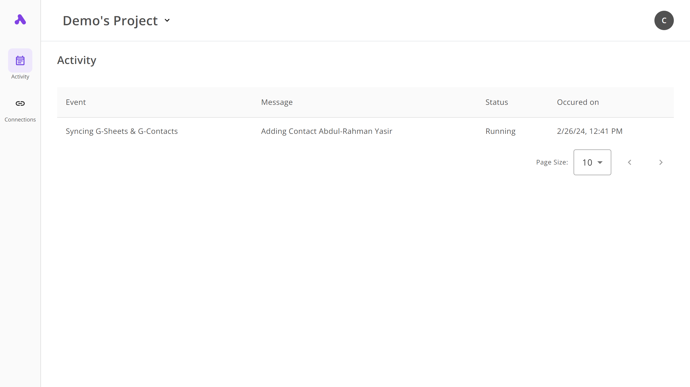
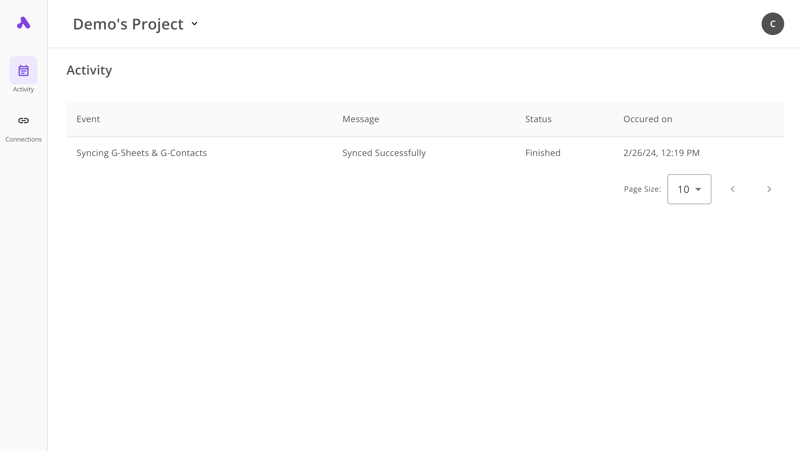

To save time for both customers and agencies ⌛, we created a table where customers can track their automations at any time they want, providing them with essential information in 4 columns (Event, Message, Status and Occurred on).

The table will be updated by the agency creating/maintaining the automation in their own preferred manner using an **Activity piece** within the flows they build.

