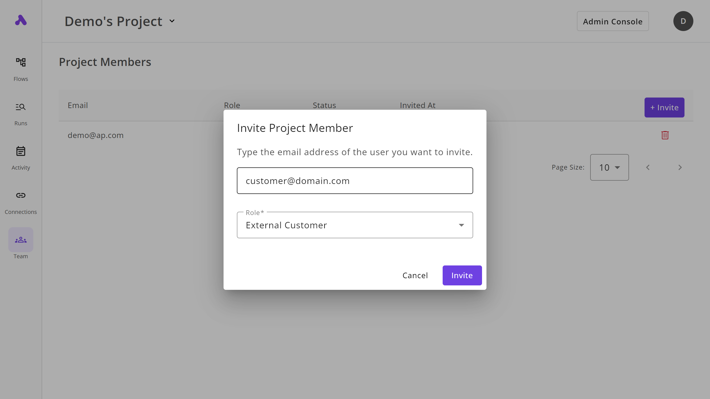

Agencies can invite their customers through their Project Members page, and assign them the “**External Customer**” role so they can be redirected to the Customer Portal once they proceed with the authentication process.

