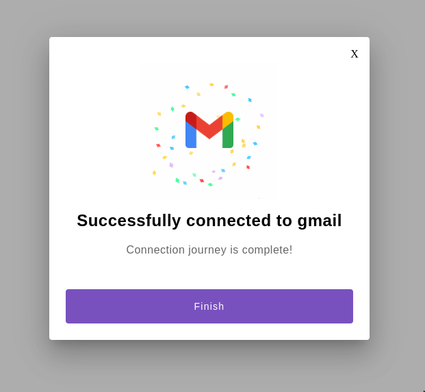

## Install JS SDK

You can install Activepieces SDK into your application with a small snippet of JavaScript in your website:

```javascript
<script type="text/javascript">
loadActualAPSdk();var loadSdkPromise;function loadActualAPSdk() {  loadSdkPromise = new Promise((resolve, reject) => {    const scriptTag = document.createElement('script');    scriptTag.src = 'https://cdn.activepieces.com/sdk/ap-sdk.js';    scriptTag.onload = () => {      setApInWindow();      resolve();    };    scriptTag.onerror = (err) => {      reject(err);    };    scriptTag.async = true;    document.head.append(scriptTag);  });}function setApInWindow() {  const apSdk = document.createElement('ap-sdk');  document.body.append(apSdk);  window.ap = apSdk;}ap = {};const methodNames = ['init', 'connect', 'disconnect', 'isConnected', 'getConnection'];for (const method of methodNames) {  ap[method] = (...args) => {    return new Promise((resolve, reject) => {      loadSdkPromise.then(        () => {          window.ap[method](...args).then(            (val) => resolve(val),            (err) => reject(err)          );        },        (err) => reject(err)      );    });  };}
</script>
```

## Authenticate:

Finally, you can use the Connection token in javascript by using the following SDK method on your frontend:

```javascript
ap.init({
  projectId: "PROJECT_ID",
  token: "CONNECTION_TOKEN",
  host: "ACTIVEPIECES_SERVER_URL"
})
```

## Connect:

<Warning>
You must contact activepieces to register your app credentials. Once this is done, you can provide the appName to connect.
</Warning>

To open authentication for certain app use the following:

```javascript
ap.connect({
  appName: "gmail"
})
```

When this is successful, you will see the following screen and the app will be available in the connections tab of the activepieces dashboard.




## Disconnect:

To disconnect from the app, you can use the following code:

```javascript
ap.disconnect({
  appName: "gmail"
})
```
