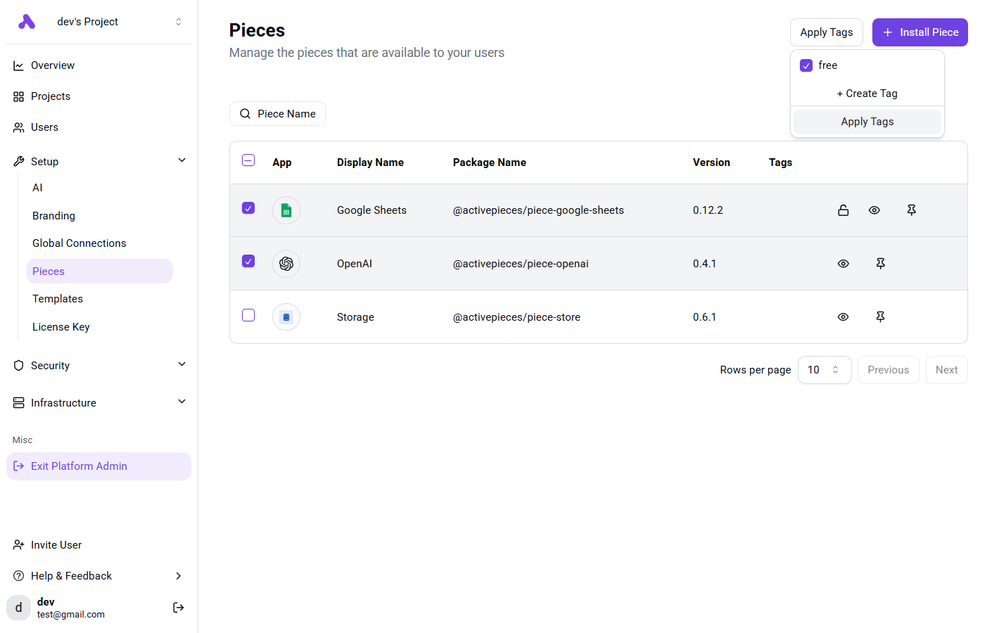

<Snippet file="enterprise-feature.mdx" />
<Snippet file="replace-oauth2-apps.mdx" />

If you would like to only show specific pieces to your embedding users, we recommend using **Piece Sets**.

## Piece Sets (recommended)

A piece set is a reusable, named selection of pieces (and, optionally, which of their actions/triggers are visible). You build the set once in the platform admin, give it a **Key**, then reference that key from your provision token.

<Steps>
    <Step title="Create a Piece Set">
        Go to **Platform Admin -> Setup -> Pieces -> Piece Sets**, create a set, choose which pieces are visible, and give it a **Key** (e.g. `premium`). If you leave the key blank, one is generated from the name.
    </Step>
    <Step title="Reference the set in the Provision Token">
        Issue a **v4** token and set the `pieceSet` claim to the set's key. Check how to generate a token in [provisioning users](./provision-users).

        ```json
        {
            /// Other claims
            "version": "v4",
            "pieceSet": "premium"
        }
        ```

        Each time the token is used by the embedding SDK, the token's project is assigned this piece set. If the key matches no set, the project falls back to the platform's default set.
    </Step>
</Steps>

## Tags (legacy)

Older integrations select pieces by tag using a **v3** token. New integrations should use piece sets instead.

<Steps>
    <Step title="Tag Pieces">
        Tag the pieces you would like to show to your user by going to **Platform Admin -> Setup -> Pieces**, selecting the pieces you would like to tag and hit **Apply Tags**

        
    </Step>
    <Step title="Add Tags to Provision Token">
       You need to specify the tags of pieces in the token, check how to generate token in [provisioning users](./provision-users).

        You should specify the `pieces` claim like this:
        ```json
        {
            /// Other claims
            "version": "v3",
            "piecesFilterType": "ALLOWED",
            "piecesTags": [ "free" ]
        }
        ```

        Each time the token is used by the embedding SDK, it will sync all pieces with these tags to the token's project. 
        The project will only contain the pieces that contain these tags.

        Only the **first** tag is honored, and it is matched against a piece set whose key equals the tag name.
    </Step>
</Steps>
