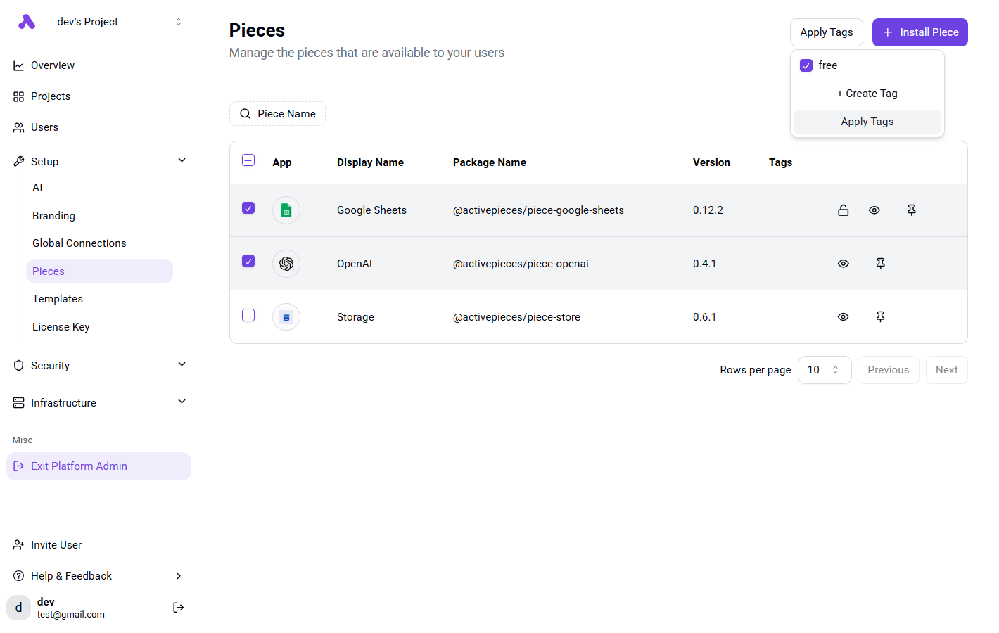

<Snippet file="enterprise-feature.mdx" />
<Snippet file="replace-oauth2-apps.mdx" />

If you would like to only show specific pieces to your embedding users, we recommend you do the following:

<Steps>
    <Step title="Tag Pieces">
        Tag the pieces you would like to show to your user by going to **Platform Admin -> Setup -> Pieces**, selecting the pieces you would like to tag and hit **Apply Tags**

        
    </Step>
    <Step title="Add Tags to Provision Token">
       You need to specify the tags of pieces in the token, check how to generate token in [provisioning users](./provision-users).

        You should specify the `pieces` claim like this:
        ```json
        {
            /// Other claims
            "piecesFilterType": "ALLOWED",
            "piecesTags": [ "free" ]
        }
        ```

        Each time the token is used by the embedding SDK, it will sync all pieces with these tags to the token's project. 
        The project will only contain the pieces that contain these tags.
    </Step>
</Steps>
