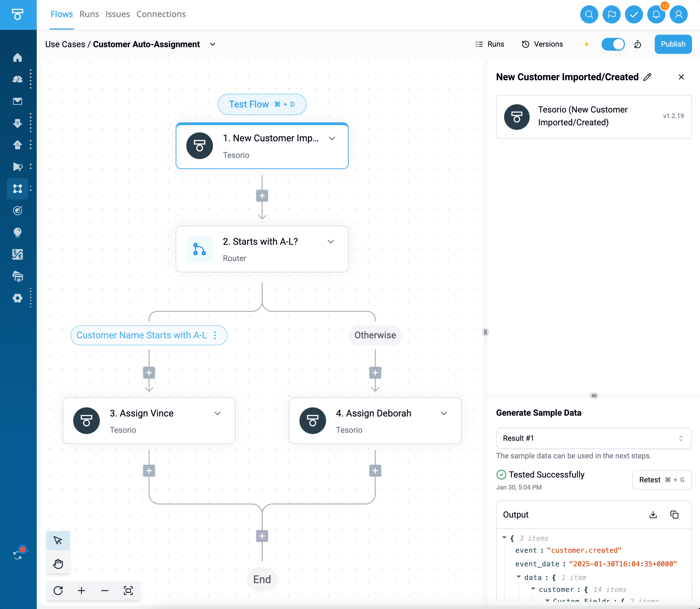

<Snippet file="enterprise-feature.mdx" />

This section provides an overview of how to embed the Activepieces builder in your application and automatically provision the user.

The embedding process involves the following steps:

<Steps>
    <Step title="Provision Users" >
        Generate a JSON Web Token (JWT) to identify your customer and pass it to the SDK, read more [here](./provision-users).
    </Step>
    <Step title="Embed Builder">
        You can use the SDK to embed and customize Activepieces in your SaaS, read more [here](./embed-builder).
    </Step>
</Steps>

   
   Here is an example of how it looks like in one of the SaaS that embed Activepieces: 
  

<Tip>
In case, you need to gather connections from your users in your SaaS. You can do this with the SDK. Find more info [here](./embed-connections).
</Tip>

<Tip>
If you are looking for a way to communicate between Activpieces and the SaaS embedding it through a piece, we recommend you check the [custom property doc](/developers/piece-reference/properties#custom-property-beta)
</Tip>

