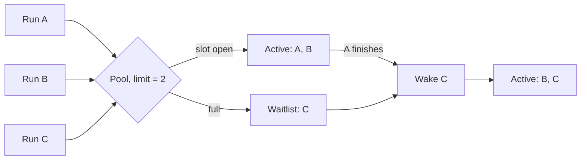
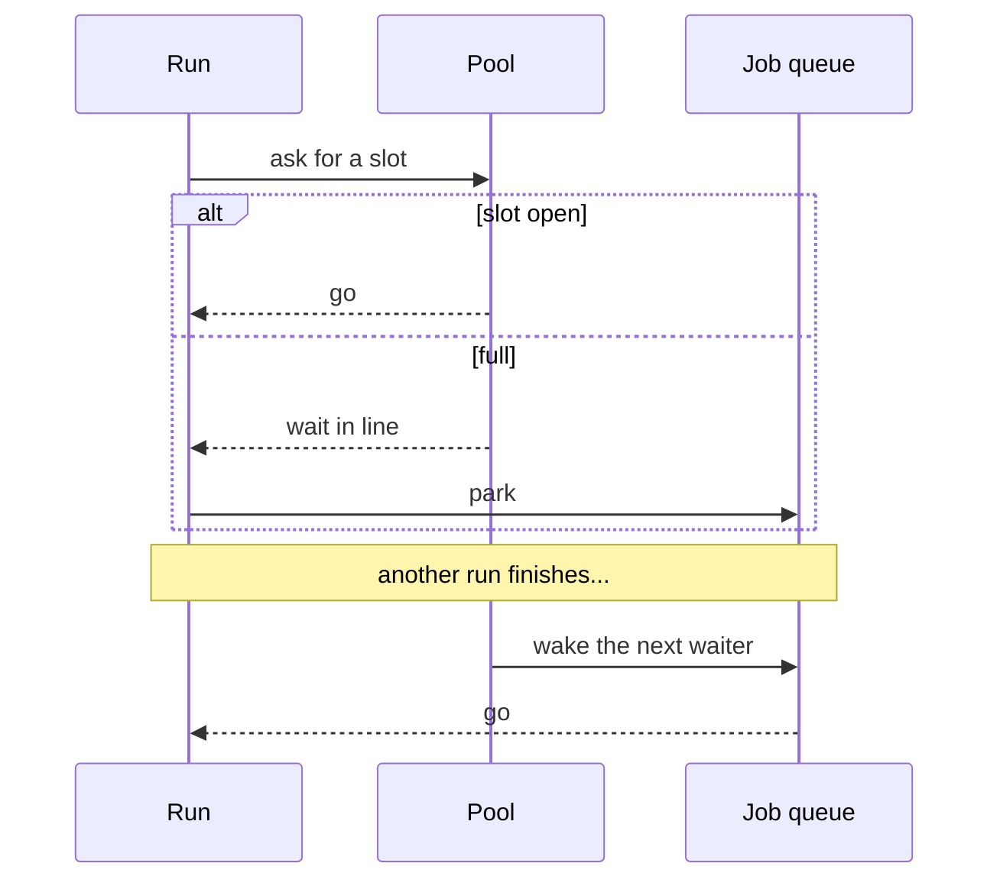

A **concurrent pool** limits how many flow runs can run at the same time. When the limit is reached, extra runs wait in a line and start the moment a slot opens up — no polling, no retry timers.

## The idea

Picture a pool as a bucket of slots:

- **Active set** — runs currently executing.
- **Waitlist** — runs queued up, in order.

When a run finishes, the next run in the waitlist takes its place instantly.



## How a run flows through



Both "ask for a slot" and "wake the next waiter" run as single atomic steps in Redis, so two runs racing can't grab the same slot and two finishes can't wake the same waiter.

## What sets the limit

For each run, the limit is picked in this order:

1. **Pool** — if the project is assigned to a shared pool, use that pool's limit.
2. **Plan** — on Cloud, fall back to the platform's plan limit.
3. **Default** — otherwise, the `AP_DEFAULT_CONCURRENT_JOBS_LIMIT` env var.

A project without a shared pool gets its own solo pool automatically.

## What bypasses the pool

- Test runs from the builder
- Webhook and polling-trigger jobs
- When `AP_PROJECT_RATE_LIMITER_ENABLED=false`

## If something goes wrong

Three timers keep the pool self-healing. The fast happy path almost always fires before any of them do — they only matter when something breaks.

| Timer | Length | What it does |
| --- | --- | --- |
| **Flow timeout** | `AP_FLOW_TIMEOUT_SECONDS` (default **600s / 10 min**) | The hard cap on how long one flow run may execute. Enforced by the engine. |
| **Stale slot sweep** | flow timeout **+ 60s** (default **11 min**) | An active-set entry older than this is assumed to come from a crashed worker. The next acquire on that pool removes it in the same Lua step. |
| **Safety-net delay** | flow timeout **+ 120s** (default **12 min**) | The BullMQ delay put on a rate-limited job when it is parked in the waitlist. If nothing wakes it sooner, BullMQ re-dispatches it after this. |

### Worker crashes mid-run

A worker process dies before `onJobFinished` can run, so its slot is never released. The active-set entry now looks like a ghost.

The next time *any* run in that pool calls `acquireSlotOrEnqueue`, the first step of the Lua script is `ZREMRANGEBYSCORE active -inf (now - sweepMs)` — entries older than the stale-slot threshold are dropped. The crashed run's slot disappears and is immediately usable.

In the worst case a slot is "wasted" for 11 minutes. No operator intervention needed.

### Waking a waiter fails

`releaseSlotAndPopWaiter` popped run C off the waitlist and reserved a slot for it, but `Job.promote()` then threw — maybe the job was cancelled by the user in the meantime, or a Redis blip lost the call.

The interceptor runs a **rollback Lua script** that undoes the reservation atomically:

1. Removes C from the active set (the slot is freed again).
2. `LPUSH`es C back onto the **head** of the waitlist (so it keeps its place — the next release picks it up first).

No runs are lost, no slots are leaked, and order-of-arrival is preserved.

### A waiter is somehow never woken

The promote-on-release path should always fire, but suppose every release in a pool races with a Redis outage, or some unknown bug prevents `onJobFinished` from running. The run C would sit in BullMQ's `delayed` state forever — except it was parked with the **safety-net delay**.

After that timer fires (flow timeout + 2 minutes), BullMQ puts C back into the `waiting` state on its own. A worker picks it up, `preDispatch` calls `acquireSlotOrEnqueue` again, and C either gets a slot or lands in the waitlist one more time.

This is a last-resort backstop. The wait here is exactly the **safety-net delay** — flow timeout + 120s, so **12 minutes** on the default configuration. In normal operation a waiter is woken within milliseconds of a release; if you ever observe a run sitting idle for 12 minutes before running, something upstream (Redis unreachable, interceptor exceptions) is swallowing the release event and needs investigating.

## Inspecting a pool

```bash
redis-cli ZCARD active_jobs_set:pool:{poolId}     # live slots
redis-cli LLEN  waiting_jobs_list:pool:{poolId}   # waiters
```
