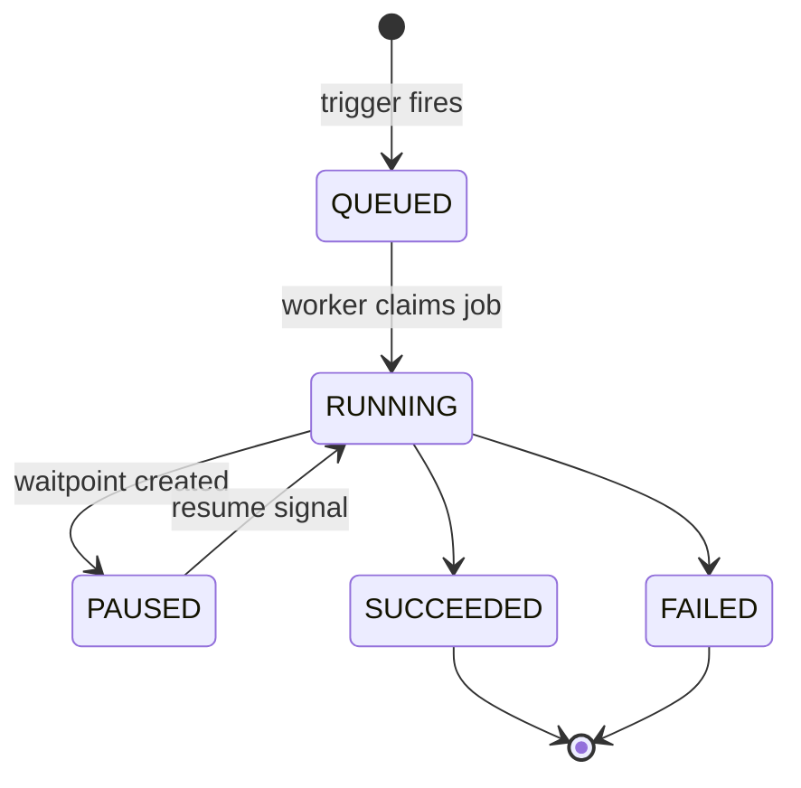
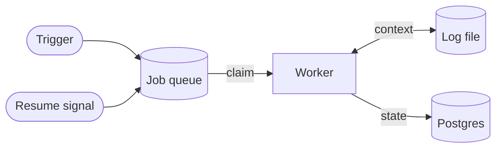

Flow runs in Activepieces are durable: progress survives worker crashes, deployments, and long pauses because state is persisted on every step boundary rather than held in a worker process.

## Guarantees

- A completed step is never re-executed implicitly. Retries are explicit (per-step or per-run).
- A paused step is never dropped. Pause state is a durable row in Postgres, not memory.
- Any worker can resume any run. There is no sticky worker and no leader election.

## How state is persisted

A running flow carries an execution context — the graph's current position, every completed step's output, the run verdict, and the loop/branch path. That context is serialized and compressed into a log file on object storage.

- Checkpointed on every step boundary, with a periodic background backup.
- Worst-case data loss on crash is the in-flight step, which is retried from the last checkpoint.
- The same checkpoint powers "retry from failed step": the pre-failure context is rebuilt and the run resumes from the exact failure point, keeping prior outputs.

## How execution is scheduled

Runs move between states via a durable job queue on Redis, not in-process calls:

1. A trigger enqueues a run. Any worker claims it.
2. When a step pauses or finishes, the worker writes the updated context and returns.
3. When a resume signal arrives (timer or callback), it enqueues a resume job against the persisted context.

Workers hold no durable state of their own, so restarts are safe and scaling is linear.

## How pause works

A paused step is represented by a **waitpoint** — a row that records which run is paused, at which step, waiting for what, plus the resume payload once it arrives. Waitpoints make two things possible:

- A timer-based pause that outlives a deployment is a delayed job plus a Postgres row. Nothing in memory.
- A callback that arrives before the `PAUSED` transition is committed is recorded against the waitpoint and replayed into the run as soon as it reaches `PAUSED`.

From the piece author's side, a paused step is invoked exactly twice — once to create the waitpoint, once to read the resume payload — regardless of how many workers handle the run in between.

The waitpoint schema, lifecycle, and race-handling protocol are on the [Waitpoints](/install/architecture/waitpoints) page.

## Consistency notes

- Flow state transitions are committed to Postgres before any side effect is acknowledged to a caller.
- Resume signals are idempotent: a waitpoint is completed at most once, and duplicate callbacks are absorbed by a uniqueness constraint on the paused step.
- On a race between "run finished pausing" and "callback arrived," the callback is pre-recorded and replayed once the run reaches `PAUSED`.
