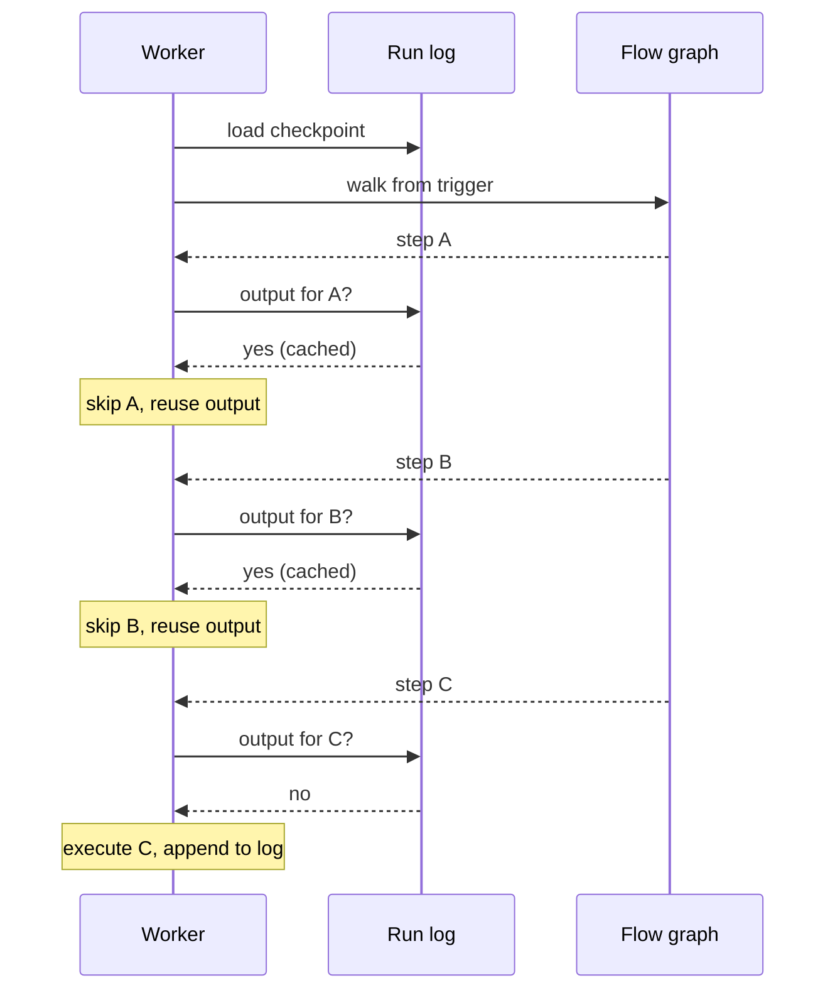

A worker is halfway through a flow when its container is recycled. Another worker picks the run up, walks the graph from the trigger, and for every step whose output is already in the run's log it skips execution and reuses the cached output. It stops at the first step that is not yet in the log and runs that one. One mechanism covers crashes, deploys, multi-day pauses, and retries.

## The run log

Every flow run has a **run log**: a single compressed checkpoint file holding everything needed to resume the run on a fresh worker.

What is in it:

- One entry per completed step, keyed by step name: input (secrets censored), output, status, duration, and error message for failed steps.
- Loop iterations and router branches are recorded with the same shape, nested under their parent step.
- Run-level tags.

When it is written:

- Once at the start of the run, before the first step executes.
- Every 15 seconds during execution, from a background loop that snapshots whatever has completed since the last write.
- Once on the final state (success, failure, or pause).

Each write overwrites the previous copy. Only the latest checkpoint is retained, and the file is compressed before upload.

## Replay and skip

Resume is not a special path. Every time a worker starts executing a run, it walks the flow graph from the trigger and at every step asks: *is the output of this step already in the log?*

- If yes, and the step completed (`SUCCEEDED` or `PAUSED`), the engine returns the cached output and moves on.
- If no, the engine executes the step, records its output, and continues.

The first time a run is scheduled the log is empty, so every step runs. After a resume the log is full up to the interruption, so the engine fast-forwards through all of it and only executes whatever came next.

Worst-case data loss on an abrupt crash is the single step that was executing when the worker died. It is re-run from the last checkpoint; everything before it is skipped.

## What triggers a resume

Every kind of interruption resolves through the same replay path; only the trigger differs.

- **Worker crash or deployment.** The queue reassigns the run to another worker, which loads the log and replays.
- **Paused step.** The piece creates a [waitpoint](/install/architecture/waitpoints). When the waitpoint fires, a resume job is enqueued and a worker replays the run.
- **Retry from failed step.** The same log is reused; the run is re-queued and a worker replays from the failure point.
- **Normal progression within one worker.** Same replay model, without leaving the process.
