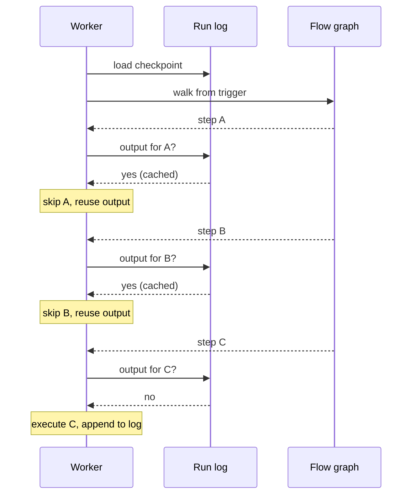

A worker is halfway through a five-step flow when its container is recycled. Another worker picks the run up seconds later, walks the graph from the trigger, and for every step whose output is already in the run's log it skips execution and reuses the cached output. It stops at the first step that is not yet in the log and runs that one. The flow finishes as if nothing happened. That is durable execution in Activepieces — one mechanism that covers crashes, deploys, multi-day pauses, and retries.

## The run log

Every flow run has a **run log**: a single compressed checkpoint file that holds everything needed to resume the run on a fresh worker.

What is in it:

- One entry per completed step, keyed by step name: its input (with secrets censored), its output, its status, its duration, and — for failed steps — the error message.
- Loop iterations and router branches are recorded with the same shape, nested under their parent step.
- Run-level tags.

When it is written:

- **Once at the start of the run**, before the first step executes, so a crash in step one still has something to resume from.
- **Every 15 seconds during execution**, by a background loop that snapshots whatever steps have completed since the last write.
- **Once on the final state** — success, failure, or pause.

Each write overwrites the previous copy of the log. Only the latest checkpoint is retained, and the file is compressed before upload so a long-running flow with large step outputs does not bloat storage.

## Replay and skip

Resume is not a special path. Every time a worker starts executing a run — the first time or the hundredth — it walks the flow graph from the trigger, and at every step asks: *is the output of this step already in the log?*

- If yes, and the step completed (`SUCCEEDED` or `PAUSED`), the engine returns the cached output immediately and moves to the next step.
- If no, the engine executes the step for real, records its output, and continues.

The first time a run is scheduled, the log is empty, so every step runs for real. After a resume, the log is full up to the interruption, so the engine fast-forwards through all of that and only executes whatever came next.

Worst-case data loss on an abrupt crash is the single step that was executing when the worker died — it is simply re-run from the last checkpoint. Everything before it is already in the log and is skipped.

## What triggers a resume

Every kind of interruption resolves through the same replay path; only the trigger differs.

- **Worker crash or deployment.** The queue reassigns the run to another worker, which loads the run log and replays.
- **Paused step.** The piece creates a [waitpoint](/install/architecture/waitpoints) (a timer or a webhook callback). When the waitpoint fires, a resume job is enqueued and a worker replays the run.
- **Retry from failed step.** The same run log is reused — the failed step stays in the log, the run is re-queued, and a worker replays up to that step and re-runs forward from there.
- **Normal progression within one worker.** The replay model still applies; the worker just never had to leave the process to do it.

## Piece-author contract

Actions are executed once per run. The only exception is an action that explicitly pauses itself: its code is entered twice — once to create the waitpoint, once to read the resume payload — regardless of how many workers the run bounces between. Everything else shows up in the log as a single entry with a single output.
