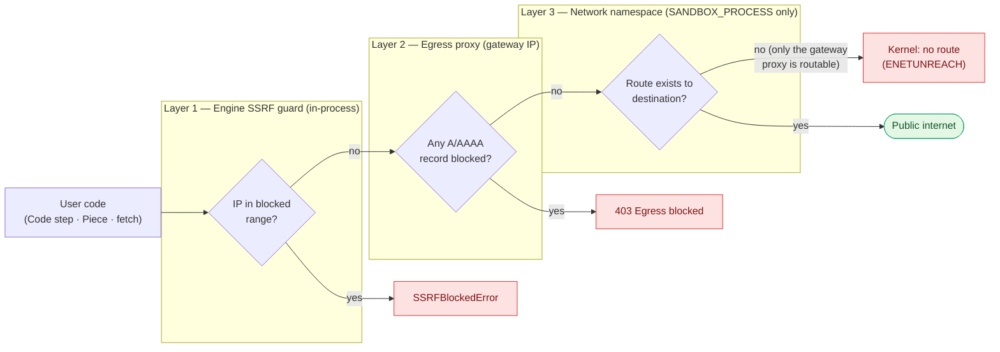

## Overview

Activepieces makes outbound HTTP from two surfaces, and each is hardened separately:

1. **User code in flows** — Code steps, piece actions, anything a flow author can write. Hardened by `AP_NETWORK_MODE`; see [User-code egress](#user-code-egress).
2. **Server-side HTTP from the API** — OAuth token claim/refresh, Vault, Conjur, event-destination webhooks, on-call pager, MCP tool validation. Always filtered, tuned via `AP_SSRF_ALLOW_LIST`; see [Server-side egress](#server-side-egress).

Both surfaces block the same set of IPs (RFC1918 private, loopback, link-local / cloud-metadata, non-unicast) and share the `AP_SSRF_ALLOW_LIST` allow-list.

## User-code egress

Every flow eventually runs **user-supplied code** — Code steps, piece actions, HTTP requests. Without an explicit boundary, that code can reach anything the host can reach: `127.0.0.1`, Redis, Postgres, the Kubernetes API, cloud-metadata endpoints (`169.254.169.254`), the VPC. `AP_NETWORK_MODE` is the switch that controls this boundary.

<Tip>
`AP_NETWORK_MODE` defaults to `UNRESTRICTED`. Set it to `STRICT` in production to opt into the full defense-in-depth stack described below.
</Tip>

| Value | Effect |
|---|---|
| `UNRESTRICTED` | No outbound guards. User code can reach any host the worker can reach. Default while the hardening stack is being validated. |
| `STRICT` | All three layers below are installed. Outbound connections to private, loopback, link-local, and cloud-metadata IPs are blocked from user code. |

Related env vars:

- `AP_SSRF_ALLOW_LIST` — comma-separated IPs that bypass the block (e.g. an internal DB or sidecar).
- In `STRICT` mode the egress proxy is wired into the sandbox automatically (via an internal `AP_EGRESS_PROXY_URL` signal). Standard `HTTP_PROXY` / `HTTPS_PROXY` env vars are intentionally **not** propagated into the sandbox, so user code cannot redirect or disable the proxy.

## How Isolation Works

In `STRICT` mode, three layers stack. Each one is a tripwire — if a request slips past one, the next one stops it.



<Steps>
  <Step title="Engine SSRF guard (in-process)">
    The engine monkey-patches Node's `dns.lookup`, `Socket.prototype.connect`, and `undici`'s global dispatcher. The moment user code resolves a hostname or opens a socket, the guard checks the resulting IP against a blocklist (every non-`unicast` range — RFC1918, loopback, link-local, multicast, cloud metadata). Covers `axios`, `fetch`, `undici`, and raw `http`/`net` in one pass.
  </Step>
  <Step title="Egress proxy (per worker)">
    The worker spins up an HTTP(S) CONNECT proxy (`proxy-chain`), bound to the sandbox's gateway IP. User code is routed through it by the engine dispatcher. The proxy re-resolves every hostname and checks **every** A/AAAA record — closing the multi-record bypass where one IP is public and another is private.
  </Step>
  <Step title="Network-namespace isolation (sandboxed modes only)">
    In isolate-based sandboxing, the worker runs the sandbox inside a dedicated restricted network namespace (`ap-egress`) whose **only** route is a `/30` veth link to the worker's gateway IP — where the proxy and the engine↔worker RPC listen. There is no default route and no NAT, so any direct connection to the internet, a private range, or `169.254.169.254` fails at the kernel with `ENETUNREACH`. Egress is blocked by routing, not a firewall — no `iptables`, no DNS holes.
  </Step>
</Steps>

## How It Applies to Each Sandbox Mode

Network Security layers on top of the sandbox execution mode — they are independent choices. The table below shows what is active in `STRICT` mode for each sandbox:

| Sandbox Mode | Engine SSRF guard | Egress proxy | Network namespace |
|---|---|---|---|
| **No Sandboxing** (`UNSANDBOXED`) | ✅ | ✅ | ❌ — no isolate namespace available |
| **V8 Sandboxing** (`SANDBOX_CODE_ONLY`) | ✅ | ✅ | ❌ — engine process shares the host network |
| **Kernel Namespaces** (`SANDBOX_PROCESS` with `isolate`) | ✅ | ✅ | ✅ — sandbox runs in the `ap-egress` netns; only the gateway is routable |

See [Sandboxing](./sandboxing) for what each sandbox mode isolates at the process level. Network Security is orthogonal: it isolates what the sandbox is allowed to *reach*, regardless of *how* it runs.

<Warning>
In `UNSANDBOXED` and V8 modes there is no kernel-level fallback. The in-process SSRF guard and the egress proxy are the only two layers — which is still strong, but a determined attacker who compromises the Node process can bypass in-process checks. Use `SANDBOX_PROCESS` in multi-tenant deployments.
</Warning>

## Verifying Your Setup

From a Code step in a test flow, try:

```js
const res = await fetch('http://169.254.169.254/latest/meta-data/')
```

With `AP_NETWORK_MODE=STRICT` you should see an `SSRFBlockedError` (from the engine guard) or a 403 from the egress proxy (for hostname-resolved requests). With `UNRESTRICTED` the request will succeed if the host allows it — confirming the guard is off.

## Rolling Out

1. Start in `UNRESTRICTED` (default) and identify any internal services that legitimate flows need to reach (internal APIs, databases used by Code steps, etc.).
2. Add those IPs to `AP_SSRF_ALLOW_LIST`.
3. Switch to `AP_NETWORK_MODE=STRICT`. Watch worker logs for `SSRFBlockedError` or `Egress proxy refused request` — each one is either an attack, a misconfigured flow, or a missing allow-list entry.

## Server-side egress

Separate from flow code, the API server itself makes outbound HTTP on behalf of admins and users — OAuth token claim/refresh, Hashicorp Vault, CyberArk Conjur, event-destination webhooks, on-call pager, MCP tool validation. The URLs come from admin config (Vault server URL) or user input (webhook destination, MCP server URL), so the same SSRF risks apply.

Unlike user-code egress, **this layer is always on** — it does not require `AP_NETWORK_MODE=STRICT`. It is implemented as a `request-filtering-agent` wrapper attached to the shared axios instances in `@activepieces/server-utils`; every outbound request flows through it. The blocked ranges are identical to the engine guard (RFC1918, loopback, link-local / cloud metadata, non-unicast).

<Tip>
`AP_SSRF_ALLOW_LIST` is shared between both surfaces. Add an IP or CIDR once and it applies to user-code egress **and** server-side HTTP. Restart the server after changing the value.
</Tip>

When a request is blocked, the axios error surfaced in the admin UI includes the `AP_SSRF_ALLOW_LIST` hint, so operators see the remediation directly in connection-test dialogs.

### Self-hosted providers on private IPs

If Vault, Conjur, an on-prem OAuth2 token endpoint, or an internal webhook resolves to a private IP, the server-side filter will reject it until you add the target to `AP_SSRF_ALLOW_LIST`:

```
AP_SSRF_ALLOW_LIST=10.0.5.12,192.168.10.0/24
```

### Relaxed TLS is still filtered

Connectors that accept self-signed certs (e.g. CyberArk Conjur in a private cluster) use `rejectUnauthorized: false`. The SSRF filter is preserved under this setting — TLS verification is relaxed, SSRF protection is not.
