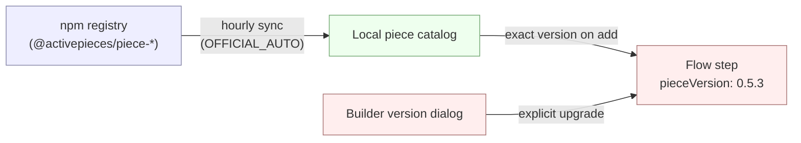

Pieces are standard [npm packages](https://www.npmjs.com/search?q=%40activepieces%2Fpiece-). Two facts follow from that:

- **No server upgrade is needed for new pieces** — a sync job pulls fresh versions on its own.
- **Each step is pinned to an exact version** — flows never auto-upgrade. Bumps are explicit, through the builder.

## Packaging

| Type | Source | Installed by |
|---|---|---|
| Official | Activepieces cloud registry | Auto-sync |
| Custom (npm) | npm registry, scoped to one platform | Platform admin |
| Private (archive) | `.tgz` upload | Platform admin |

Custom and private pieces are managed manually — see [Manage pieces](/admin-guide/guides/manage-pieces).

## Auto-sync

| `AP_PIECES_SYNC_MODE` | Behavior |
|---|---|
| `OFFICIAL_AUTO` | Hourly reconcile against the cloud registry. Default on Cloud. |
| `NONE` | Disabled. Catalog only changes via admin actions. Use for air-gapped or change-controlled environments. |

Custom and private pieces are never touched by the sync job.

## Server compatibility

Every piece declares a `minimumSupportedRelease` (and optional `maximumSupportedRelease`) in its definition — the range of Activepieces server releases it works on. The catalog filters pieces against the running server's release, so an out-of-range piece is never listed in the builder and never served from the registry.

<Warning>
**Self-hosted: upgrade to `0.82.0` or newer.** Every new piece now declares `minimumSupportedRelease ≥ 0.82.0`, the floor that came in with the latest piece-context version. Servers below `0.82.0` will not pick up any newly published pieces or bug fixes. Cloud is always on the latest release.
</Warning>

## Version pinning

Adding a step records the exact piece version at that moment (e.g. `0.5.3`). The pin stays until a human changes it. To upgrade, open the step in the builder, click the version next to its name, and pick a new one. The dialog warns when the change crosses a minor or major boundary.

## Related

- [Manage pieces](/admin-guide/guides/manage-pieces) — install, hide, upload custom pieces.
- [Piece versioning](/build-pieces/piece-reference/piece-versioning) — semver rules for piece authors.
