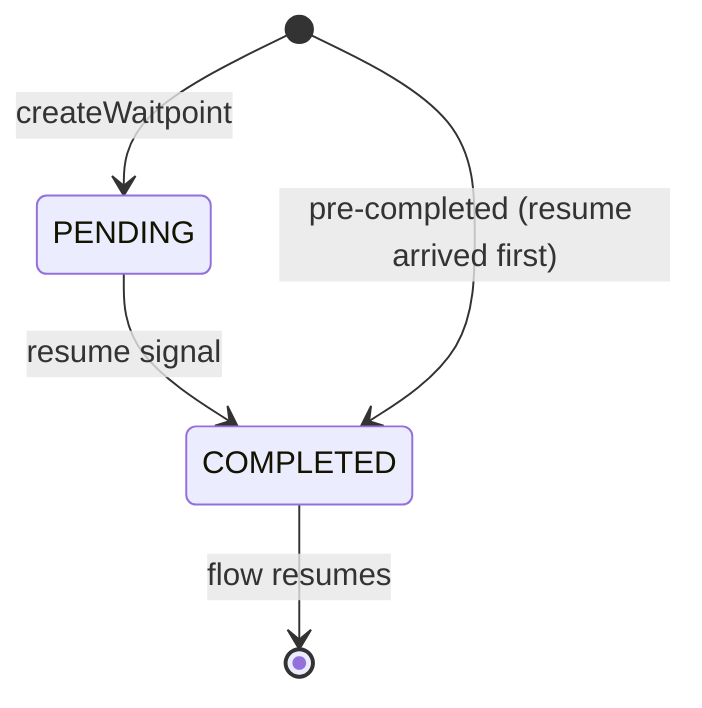
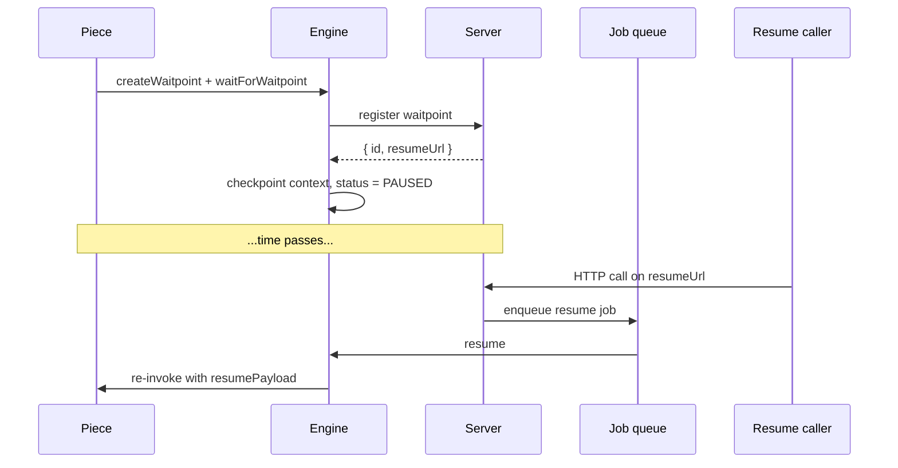

A **waitpoint** is the durable row that represents a paused step on a flow run. The flow run row only carries status (`PAUSED`, `RUNNING`, …); the *why* lives on the waitpoint.

## Schema

| Field | Meaning |
| --- | --- |
| `flowRunId`, `stepName` | Which run/step is paused. Unique together: a step has at most one waitpoint. |
| `type` | `DELAY` or `WEBHOOK`. |
| `status` | `PENDING` until the resume signal arrives, then `COMPLETED`. |
| `resumeDateTime` | For `DELAY`: when to fire the resume. |
| `responseToSend` | For `WEBHOOK`: optional HTTP response returned immediately to the original webhook trigger. |
| `resumePayload` | `{ body, headers, queryParams }` from the resume call, surfaced to the piece as `ctx.resumePayload`. |

## Types

- **`DELAY`**: resumes at `resumeDateTime`. The server schedules a one-time job for that timestamp. The delay is bounded by a configurable server-side maximum.
- **`WEBHOOK`**: resumes on any HTTP call to the waitpoint's resume URL. If `responseToSend` is set, it is replied immediately to the original trigger so a single webhook can respond-then-pause.

## Lifecycle

1. **Create.** The piece calls `ctx.run.createWaitpoint({ type, ... })` + `ctx.run.waitForWaitpoint(id)`. The engine marks the step as `paused` and asks the server to insert a `PENDING` row. The insert is idempotent on the `(flow run, step)` pair.
2. **Checkpoint.** The engine serializes the execution context and transitions the flow run to `PAUSED`.
3. **Resume signal.** Either an HTTP call on the resume URL or the scheduled job firing. Both carry `{ body, headers, queryParams }`.
4. **Re-run.** A worker rebuilds the context and re-invokes the same action with `ctx.executionType === ExecutionType.RESUME` and `ctx.resumePayload` populated.

## Resume-before-pause race

A callback can arrive before the flow run has finished writing `PAUSED` to disk. The protocol absorbs the race:

- Completing a waitpoint takes a write lock on the `PENDING` row. If it exists, it flips to `COMPLETED` and stores the `resumePayload`. If it does not, a **pre-completed** row is inserted instead.
- When the flow run transitions to `PAUSED`, the server checks for a matching `COMPLETED` waitpoint and enqueues the resume job immediately.

Duplicate callbacks are absorbed by the uniqueness constraint; the engine never processes a resume twice.

## Endpoints

| Method | Path | Notes |
| --- | --- | --- |
| `POST` | `/v1/waitpoints` | Engine-only. Creates a `PENDING` waitpoint, returns its resume URL. |
| `ALL` | `/v1/flow-runs/:id/waitpoints/:waitpointId` | Resume, async. |
| `ALL` | `/v1/flow-runs/:id/waitpoints/:waitpointId/sync` | Resume, sync. The HTTP response is whatever the flow produces after resuming. |

## Piece API

Piece authors create waitpoints with `ctx.run.createWaitpoint` / `ctx.run.waitForWaitpoint`. Patterns for `WEBHOOK`, `DELAY`, and `responseToSend` are in Flow Control.
