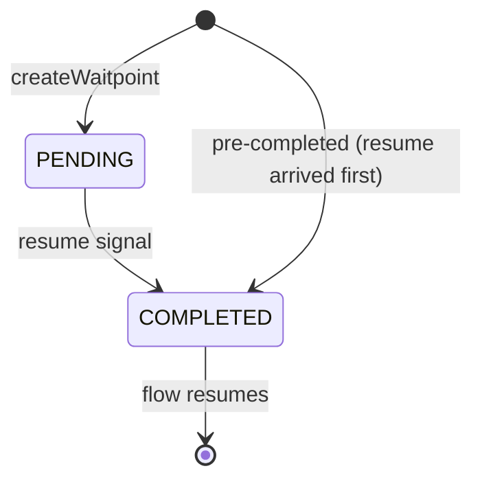
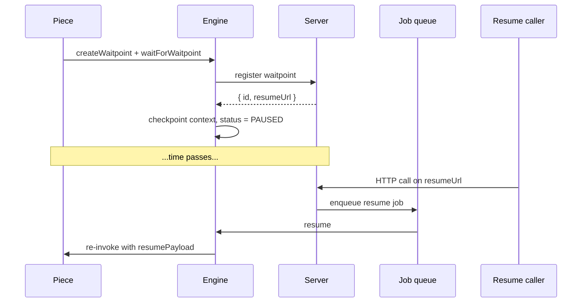

A **waitpoint** is the durable row that represents a paused step on a flow run. The flow run row only carries status (`PAUSED`, `RUNNING`, …); the *why* lives on the waitpoint.


```mermaid
stateDiagram-v2
    [*] --> PENDING: createWaitpoint
    PENDING --> COMPLETED: resume signal
    COMPLETED --> [*]: flow resumes
    [*] --> COMPLETED: pre-completed (resume arrived first)
```

## Schema

| Field | Meaning |
| --- | --- |
| `flowRunId`, `stepName` | Which run/step is paused. Unique together: a step has at most one waitpoint. |
| `type` | `DELAY`, `WEBHOOK` or `BARRIER`. |
| `status` | `PENDING` until the resume signal arrives, then `COMPLETED`. |
| `resumeDateTime` | For `DELAY`: when to fire the resume. |
| `responseToSend` | For `WEBHOOK`: optional HTTP response returned immediately to the original webhook trigger. |
| `resumePayload` | `{ body, headers, queryParams }` from the resume call, surfaced to the piece as `ctx.resumePayload`. |
| `sealed` | `BARRIER` only: no more signals will be added. |
| `policy` | `BARRIER` only: `{ requiredSuccesses?, releaseOnFirstFailure?, reasonRequiredOn? }`. |

## Types

- **`DELAY`**: resumes at `resumeDateTime`. The server schedules a one-time job for that timestamp. The delay is bounded by a configurable server-side maximum.
- **`WEBHOOK`**: resumes on any HTTP call to the waitpoint's resume URL. If `responseToSend` is set, it is replied immediately to the original trigger so a single webhook can respond-then-pause.
- **`BARRIER`**: resumes once every awaited thing has reported back. See below.

## Barriers

A **barrier** pauses a run until N things report back — the batches a `Process in Batches` step dispatched,
or the approvers on one approval. It is a waitpoint plus one **signal** row per awaited thing, created up
front:

| Field | Meaning |
| --- | --- |
| `id` | Primary key **and** the resume-link token. Random and unguessable, so possession of one link never lets you forge another. |
| `refId` | What the signal stands for — the child run id, or the approval link. |
| `sequence` | The producer's ordinal (batch index). Null when the producer needs no second idempotency key. |
| `label` | The human name in the summary — an approver's email, a branch path. Never a credential. |
| `status` | `PENDING` until it reports, then `SUCCEEDED` / `FAILED` / `REJECTED` / `CANCELED` / `NOT_DISPATCHED`. |
| `result` | A small bounded payload — the outcome, the run id, or an approver's reason. |

**Release is an unconditional floor rule: a sealed barrier releases once no signal is still `PENDING`.** No
configuration can produce a hang. `policy` only ever releases *sooner* — `requiredSuccesses` covers 2-of-3
approvals, `releaseOnFirstFailure` covers a veto. Signals left pending at an early release are reported
truthfully as `stillRunning`.

The step resumes with one shape, so an expression never breaks on fan-out width:

```json
{ "total": 3, "succeeded": 2, "failed": 1, "rejected": 0, "canceled": 0,
  "notDispatched": 0, "stillRunning": 0, "timedOut": false,
  "signals": [ { "sequence": 0, "label": null, "outcome": "SUCCEEDED", "result": null, "runId": "..." } ] }
```

The `signals` array is present only when `total <= 100`; above that only the counts travel and
`signalsTruncated` is set. `AP_MAX_BARRIER_SIGNALS` (default 10 000) caps how many things one barrier may
wait on. A barrier's deadline is set when it is created, from `AP_PAUSED_FLOW_TIMEOUT_DAYS`, and never moves.

## Lifecycle

1. **Create.** The piece calls `ctx.run.createWaitpoint({ type, ... })` + `ctx.run.waitForWaitpoint(id)`. The engine marks the step as `paused` and asks the server to insert a `PENDING` row. The insert is idempotent on the `(flow run, step)` pair.
2. **Checkpoint.** The engine serializes the execution context and transitions the flow run to `PAUSED`.
3. **Resume signal.** Either an HTTP call on the resume URL or the scheduled job firing. Both carry `{ body, headers, queryParams }`.
4. **Re-run.** A worker rebuilds the context and re-invokes the same action with `ctx.executionType === ExecutionType.RESUME` and `ctx.resumePayload` populated.


```mermaid
sequenceDiagram
    participant Piece
    participant Engine
    participant Server
    participant Queue as Job queue
    participant Caller as Resume caller

    Piece->>Engine: createWaitpoint + waitForWaitpoint
    Engine->>Server: register waitpoint
    Server-->>Engine: { id, resumeUrl }
    Engine->>Engine: checkpoint context, status = PAUSED
    Note over Piece,Server: ...time passes...
    Caller->>Server: HTTP call on resumeUrl
    Server->>Queue: enqueue resume job
    Queue->>Engine: resume
    Engine->>Piece: re-invoke with resumePayload
```

## Resume-before-pause race

A callback can arrive before the flow run has finished writing `PAUSED` to disk. The protocol absorbs the race:

- Completing a waitpoint takes a write lock on the `PENDING` row. If it exists, it flips to `COMPLETED` and stores the `resumePayload`. If it does not, a **pre-completed** row is inserted instead.
- When the flow run transitions to `PAUSED`, the server checks for a matching `COMPLETED` waitpoint and enqueues the resume job immediately.

Duplicate callbacks are absorbed by the uniqueness constraint; the engine never processes a resume twice.

## Endpoints

| Method | Path | Notes |
| --- | --- | --- |
| `POST` | `/v1/waitpoints` | Engine-only. Creates a `PENDING` waitpoint, returns its resume URL. For `BARRIER`, also creates its signals. |
| `ALL` | `/v1/flow-runs/:id/waitpoints/:waitpointId` | Resume, async. |
| `ALL` | `/v1/flow-runs/:id/waitpoints/:waitpointId/sync` | Resume, sync. The HTTP response is whatever the flow produces after resuming. |

## Piece API

Piece authors create waitpoints with `ctx.run.createWaitpoint` / `ctx.run.waitForWaitpoint`. Patterns for `WEBHOOK`, `DELAY`, and `responseToSend` are in Flow Control.

