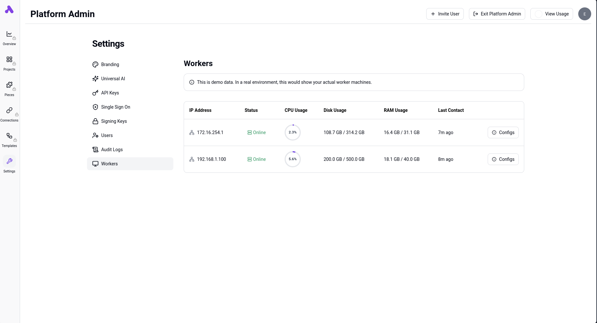

Benefits of separating workers from the main application (APP):

- **Availability**: The application remains lightweight, allowing workers to be scaled independently.
- **Security**: Workers lack direct access to Redis and the database, minimizing impact in case of a security breach.


<Steps>
  <Step title="Create Worker Token">
    Create a worker token by executing `npm run workers token` at the root of the repository. You will be prompted to enter a JWT secret, after which the token will be generated.
    
  </Step>
  <Step title="Configure Environment Variables">
    Define the following environment variables in the `.env` file on the worker machine:
    - Set `AP_CONTAINER_TYPE` to `WORKER`
    - Specify `AP_FRONTEND_URL`
    - Provide `AP_WORKER_TOKEN`
  </Step>
  <Step title="Configure Persistent Volume">
    Configure a persistent volume for the worker to cache flows and pieces. This is important as first uncached execution of pieces and flows are very slow. Having a persistent volume significantly improves execution speed.
    
    Add the following volume mapping to your docker configuration:
    ```yaml
    volumes:
      - <your path>:/usr/src/app/cache
    ```
  </Step>
  <Step title="Launch Worker Machine">
    Launch the worker machine and supply it with the generated token.
  </Step>
  <Step title="Verify Worker Operation">
    Verify that the workers are visible in the Platform Admin Console under Infra -> Workers.
    
  </Step>
  <Step title="Configure App Container Type">
    On the APP machine, set `AP_CONTAINER_TYPE` to `APP`.
  </Step>
</Steps>
