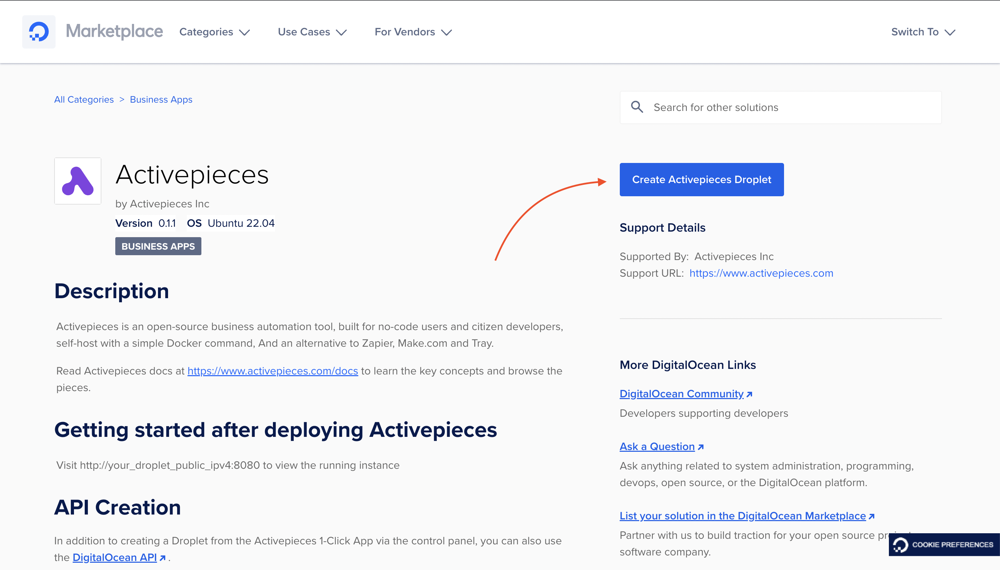
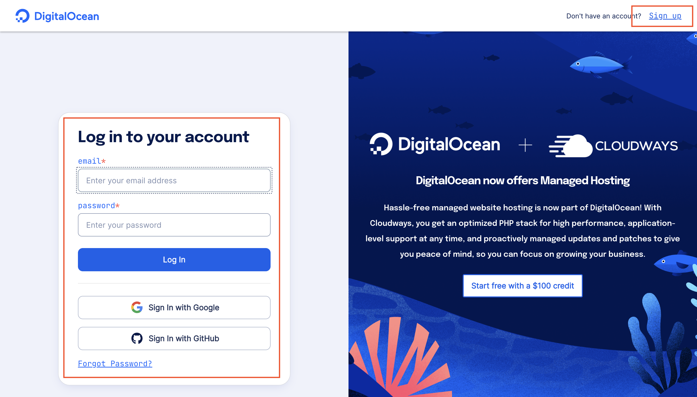
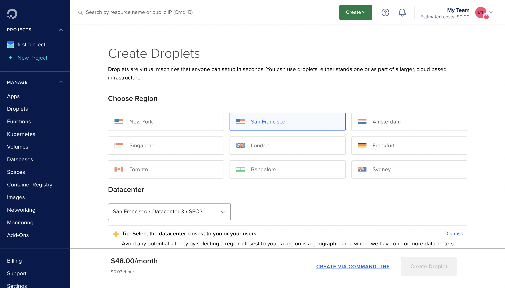
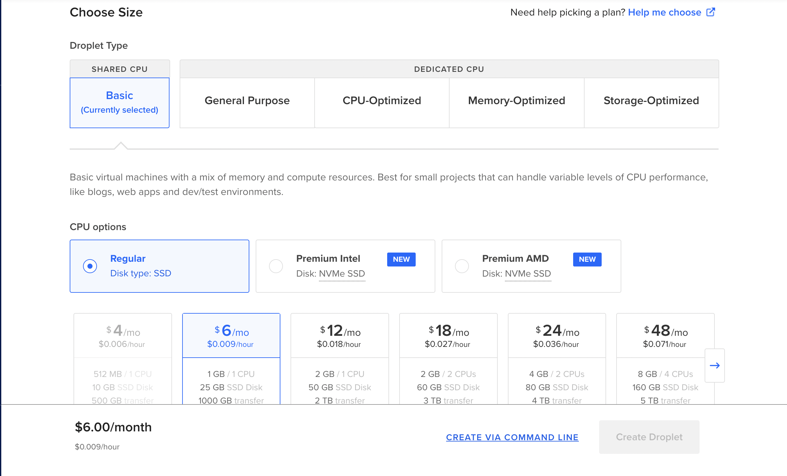
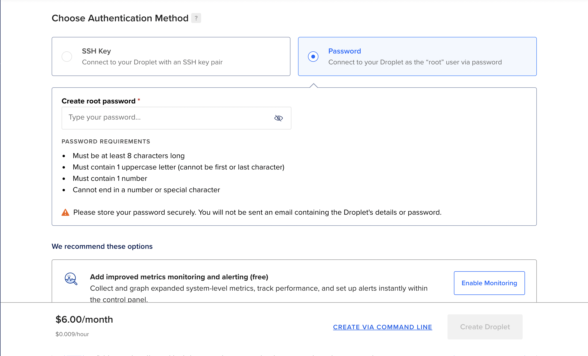
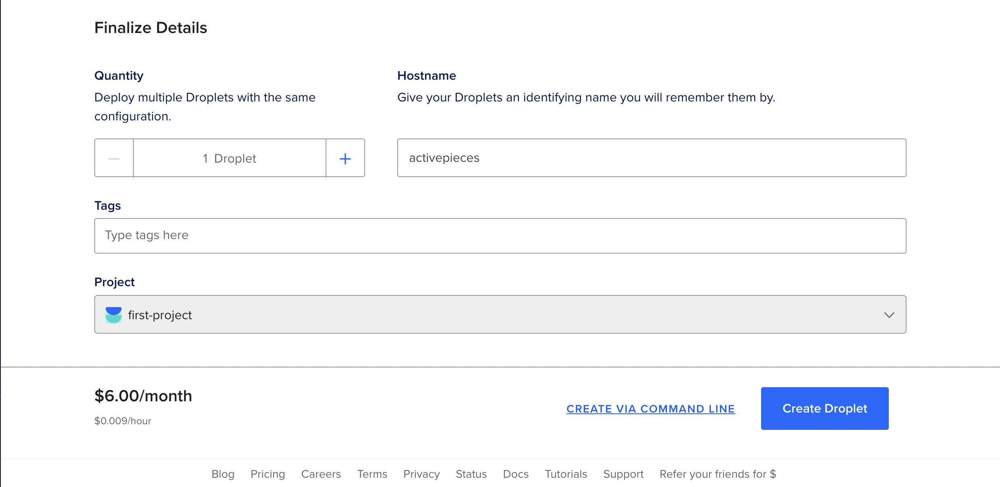
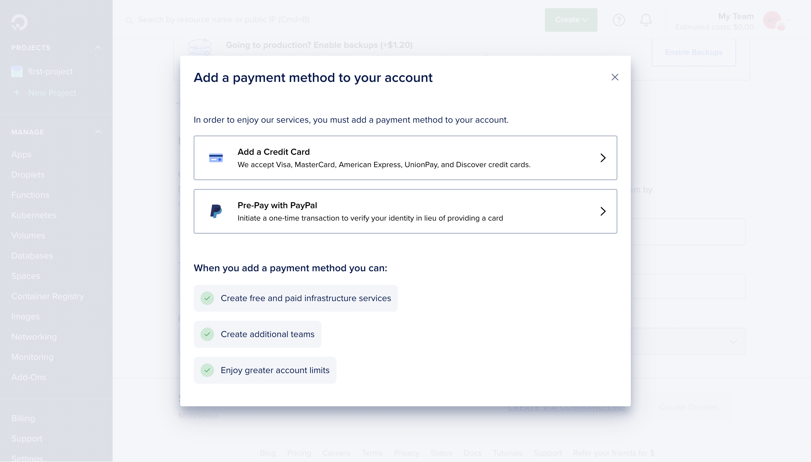
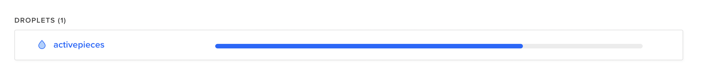
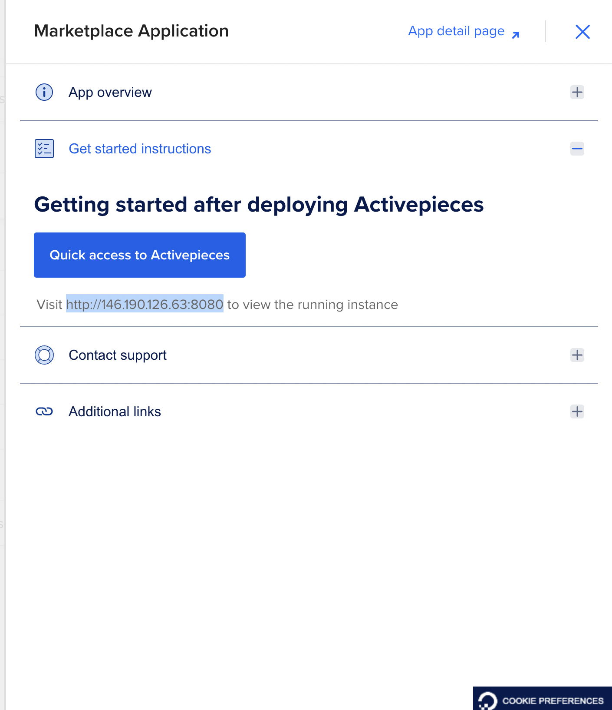
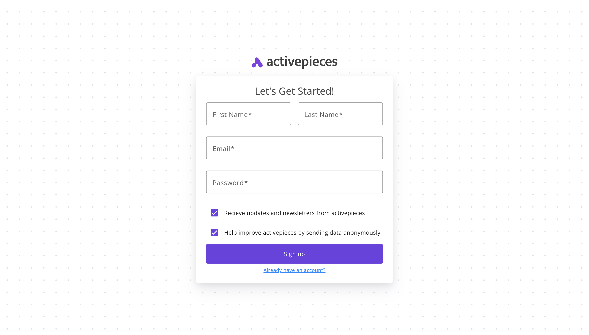

## What is DigitalOcean?

DigitalOcean is a simpler cloud provider than AWS and Google Cloud. Droplets on DigitalOcean are virtual machines on which you can host your apps.

<Warning>Hosting Activepieces on DigitalOcean has cost (DigitalOcean fees). If you're looking for free ways to play around with Activepieces, consider trying out the [Playground](https://demo.activepieces.com) or the [other deployment methods](./overview).</Warning>

## Install Activepieces

### Create Account

1. Go to [Activepieces on DigitalOcean Marketplace](https://marketplace.digitalocean.com/apps/activepieces), and click on **Create Activepieces Droplet**.

2. You will see the login page, use your account to login or Sign Up for an new DigitalOcean account.

### Configure Droplet

3. Once you log in, you will land on the **Create Droplets** page to create your Activepieces droplet. Choose your **droplet region** in the first section, choose the closest region to you. Don't worry about the Datacenter and Network.

4. Now skip the **Choose Image** section, it has the Activepieces image preset.

5. Choose the **size** of the droplet. We're choosing the smallest and cheapest one here.

6. Choose how you'd like to access the machine later if you need it. We recommend choosing the method you're most familiar with, SSH keys are always more secure.

7. Now choose the name of the droplet under **Hostname**. You can name it just `activepieces`.

8. It's time to create the droplet. Click on **Create Droplet**, and fill your payment details (only if you haven't done it before).

### Access Activepieces

9. You will be redirected to your main **Resources** page, and your new droplet will have a progress bar while starting up.

☕ 😎 Time to refill your coffee until the droplet is initialized. This should take a few minutes to complete.

10. You know you're good to go when you see the **Get Started** link on the droplet. Click on it.

11. You will find the link of your droplet (highlighted in the screenshot) -- copy it.

12. Paste the link in your browser, Activepieces sign up page will show up. This is hosted on your server, it will sign you up on your server and you are the owner of the data.

13. Once you sign up, you will land on Activepieces dashboard.

This is awesome 🎊 You know how to set up Activepieces on DigitalOcean now. It's time to [create your first flow](../getting-started/quickstart).