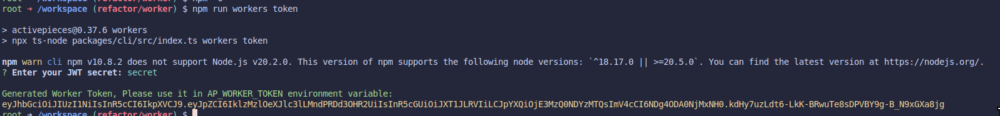
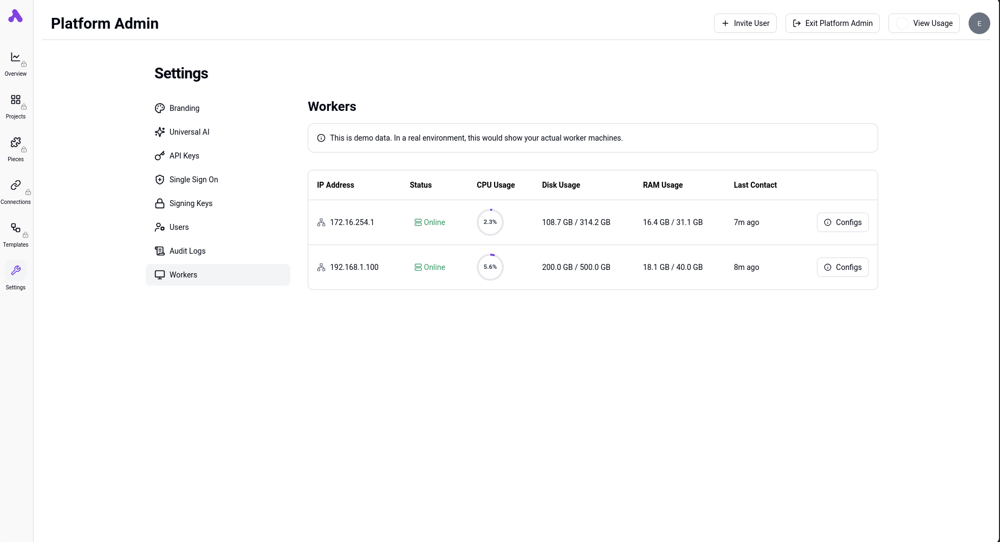

Benefits of separating workers from the main application (APP):

- **Availability**: The application remains lightweight, allowing workers to be scaled independently.
- **Security**: Workers lack direct access to Redis and the database, minimizing impact in case of a security breach.

<Warning>
**Sync webhooks (`/sync` URLs)** require APP and WORKER to use the same Redis pub/sub channel for flow responses. In split deployments, enable the stable engine response server id on **both** the APP and every WORKER container:

- `AP_STABLE_ENGINE_RESPONSE_SERVER_ID_ENABLED=true` (default in the server; set explicitly on split deployments so every container agrees)
- Use the **same** `AP_ENCRYPTION_KEY` on APP and all workers (when no override is set, the shared id is derived from this key), **or** set the same explicit `AP_ENGINE_RESPONSE_SERVER_ID` on every container.

If the flag is set to `false` or secrets differ between APP and workers, sync webhooks may complete in the background but return **204 No Content** to the caller instead of the flow response body.
</Warning>

<Steps>
  <Step title="Create Worker Token">
    To create a worker token, use the local CLI command to generate the JWT and sign it with your `AP_JWT_SECRET` used for the app server. Follow these steps:
    1. Open your terminal and navigate to the root of the repository.
    2. Run the command: `npm run workers token`.
    3. When prompted, enter the JWT secret (this should be the same as the `AP_JWT_SECRET` used for the app server).
    4. The generated token will be displayed in your terminal, copy it and use it in the next step.
    
  </Step>
  <Step title="Configure Environment Variables">
    Define the following environment variables in the `.env` file on the worker machine:
    - Set `AP_CONTAINER_TYPE` to `WORKER`
    - Specify `AP_FRONTEND_URL`
    - Provide `AP_WORKER_TOKEN`
    - Ensure `AP_STABLE_ENGINE_RESPONSE_SERVER_ID_ENABLED` is `true` on workers and APP (server default; must match across containers)
    - Use the same `AP_ENCRYPTION_KEY` as the APP server, or the same `AP_ENGINE_RESPONSE_SERVER_ID` if you override the derived id
  </Step>
  <Step title="Configure Persistent Volume">
    Configure a persistent volume for the worker to cache flows and pieces. This is important as first uncached execution of pieces and flows are very slow. Having a persistent volume significantly improves execution speed.
    
    Add the following volume mapping to your docker configuration:
    ```yaml
    volumes:
      - <your path>:/usr/src/app/cache
    ```
    Note: This setup works whether you attach one volume per worker, It cannot be shared across multiple workers.
  </Step>
  <Step title="Launch Worker Machine">
    Launch the worker machine and supply it with the generated token.
  </Step>
  <Step title="Verify Worker Operation">
    Verify that the workers are visible in the Platform Admin Console under Infra -> Workers.
    
  </Step>
  <Step title="Configure App Container Type">
    On the APP machine, set `AP_CONTAINER_TYPE` to `APP`, and set the same sync-webhook variables as on workers: `AP_STABLE_ENGINE_RESPONSE_SERVER_ID_ENABLED=true` plus a matching `AP_ENCRYPTION_KEY` or `AP_ENGINE_RESPONSE_SERVER_ID`.
  </Step>
</Steps>
