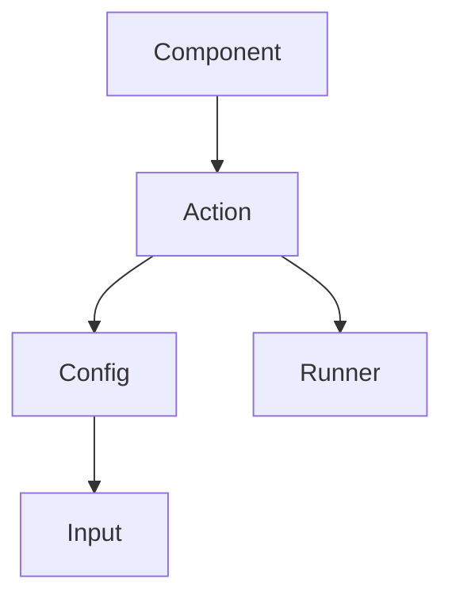

# High-level Design

## Block diagram

## Terminology

- **Component**
  - Integrates with an external service provider, for e.g. a Slack component.
  - Consists of multiple actions.
- **Action**
  - A specific operation provided by the component, for e.g. send a Slack message.
  - Consists of a configuration and a runner.
- **Configuration**
  - Describes the list of inputs required to perform a specific action, for e.g. the channel name to send a
  Slack message to.
  - Consists of multiple inputs.
- **Runner**
  - Describes the actual steps required to perform a specific action, for e.g. send an HTTP request to Slack API.
  - Receives the actual values of the configuration provided by the component user.
- **Input**
  - A configuration property the needs user input before invoking an action.
  - Has multiple types: `long text`, `short text`, and a `dropdown`.
