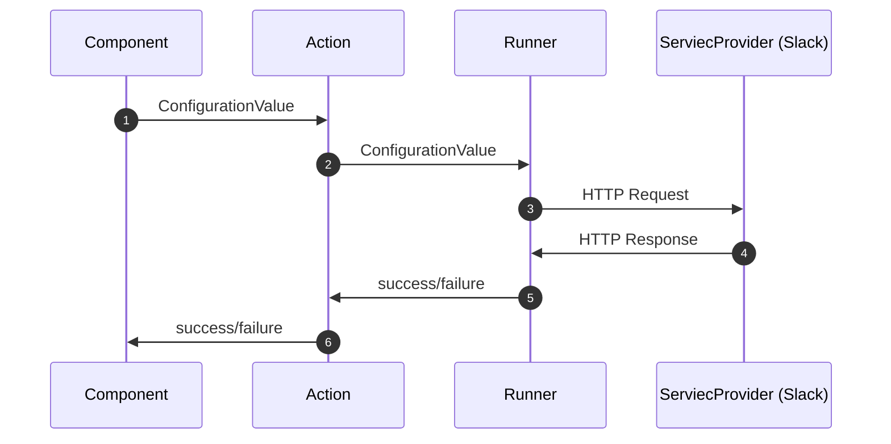

# Low-level Design

## Class Diagram

```mermaid
classDiagram
    class Component {
        <<interface>>
        actions: Record~string, Action~
    }
    class Action {
        <<interface>>
        config: Configuration
        run: Runner
    }
    class Runner {
        <<interface>>
        (config: ConfigurationValue): RunnerStatus
    }
    class Configuration {
        <<interface>>
        inputs: Input[]
    }
    class ConfigurationValue {
        <<interface>>
        inputs: Record~string, string~
        authentication: AuthenticationConfig
    }
    class AuthenticationConfig {
        <<interface>>
        accessToken: string
    }
    class RunnerStatus {
        <<interface>>
        success: boolean
    }
    class Input {
        <<interface>>
        name: string
        displayName: string
        type: InputType
        required: boolean
        options?: string[]
    }
    class InputType {
        <<enumeration>>
        SHORT_TEXT
        LONG_TEXT
        DROPDOWN
    }

    Component o-- Action
    Action *-- Runner
    Action *-- Configuration
    Runner --> ConfigurationValue
    ConfigurationValue *-- AuthenticationConfig
    Runner --> RunnerStatus
    Configuration o-- Input
    Input --> InputType
```

### Component
- A Wrapper for `Action`s exposed by a service provider.
- Members
  - `actions`: a map of `Action` objects, for e.g. a `SlackComponent` has a `sendMessage` action inside this map.

### Action
- An operation exposed by a `Component`.
- Members
  - `config`: specifies the inputs required by this particular `Action`.
  - `run()`: a method that defines the steps required to perform this particular `Action`.
  It implements the `Runner` interface.

### Configuration
- A specification for the inputs required by a particular `Action`.
- Used by the frontend builder to prompt the user for the required input.
- Members
  - `inputs`: an array of `Input`s required to invoke a particular `Action`.

### Runner
- Defines the interface for the `Action#run()` method.
- Parameters
  - `configValue`: holds the value of the `inputs` for this particular run, and the authentication details.
- Returns a `RunnerStatus` object which contains whether the `Action` performed was successful
  or not.

### ConfigurationValue
- Holds the values of `Configuration` inputs for a particular run of an `Action`.
- Members
  - `inputs`: a map containing the values of inputs defined in the corresponding `Configuration`.
  - `authentication`: contains the `accessToken` required to connect to the service provider API.

### RunnerStatus
- Represents the final state of a particular `Action` run.
- Members
  - `success`: boolean indicating whether the `Runner` succeeded or not.

### Input
- Models the `Configuration` inputs.
- Members
  - `name`: name of the input as exposed to the `Action#run()` method.
  - `displayName`: name displayed to the user when using the frontend builder.
  - `type`: used to guide the frontend builder on the type of HTML input to be used for this
  `Input`. Allowed values are defined by `InputType` enum.
  - `required`: a boolean indicating whether this `Input` is required or not.
  - `options`: an optional array of strings holding options for inputs like dropdowns, radios,
  checkboxes...etc.

### InputType
- Defines the allowed `Input` types
- Values
  - `SHORT_TEXT`: models `<input type="text">`
  - `LONG_TEXT`: models `<textarea>`
  - `DROPDOWN`: models `<select>`

## Sequence Diagram



1. The `Component` invokes a particular `Action` passing the `ConfigurationValue`. The `ConfigurationValue`
  contains the input values as well as the authentication details.
2. The `Action` delegates the call to the `Runner` passing the `ConfigurationValue`.
3. The `Runner` performs the necessary steps required including sending any HTTP requests to the corresponding
  service provider API.
4. The `Runner` receives the HTTP response of the service provider API and translates the response to a
  `RunnerStatus` object.
5. The `Runner` returns control to the calling `Action` with the details of the success/failure in a
  `RunnerStatus` object.
6. Finally, the control is returned to the `Component`.
